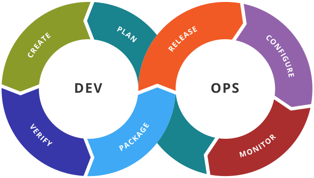

# Intro to DevOps

Welcome to the wonderful world of (Dev)elopment(Op)eration(s) engineering! Now you see where the word comes from 🚀.

This is an extraordinarly lucrative field that millions of people across the world are a part of.

Some interesting statistics to take note of:
- As of 2021, the total market size of tech globally is around $5.2 trillion [source](https://www.zippia.com/advice/tech-industry-statistics/#:~:text=How%20much%20is%20the%20tech,approximate%20worth%20of%20%241.8%20trillion.)
- Average salary of a DevOps engineer is in the range $118,972 - $139,790 (as of June 2023) [source](https://www.salary.com/research/salary/listing/devops-engineer-salary#:~:text=Didn't%20find%20your%20job,falls%20between%20%24118%2C972%20and%20%24139%2C790.)
- About 83% of developers (includes DevOps engineers) work remote more than half the time (as of June 2023) [source](https://devops.com/developers-continue-to-prefer-remote-work/)

We've grabbed your attention now right? There is a lot of 💰 to be made in this field, as well as flexibility in regards to working remotely.

This is definitely a big incentive for people who are interested in being a DevOps engineer, but the other reality (which I truly believe) is that DevOps is an extremely fun career, and I hope that I can convince you of that through the course.

Let's get started!

## What is DevOps?
Let's first look at this image, and we'll follow it up with an example:

This is the Software Development lifecycle, and most companies go through this approach when implementing new features, especially if they are operating a live software product.

To put it plain and simple, DevOps is the discipline of making this Software Development lifecycle faster, more efficient, and seemless for everybody involved in it. This sounds simple enough, but is actually a hard problem which has no one size-fits-all solution. This is why DevOps engineers are particuarly important in todays day and age.

### Example
Let's say Instagram has gotten requests from its users to increase the length of Instagram stories to 120 seconds at maximum. The product team at Instagram sees this as a valid request, so they start to `plan` this feature.

The engineers know all the technical ins and outs of how to bring this feature to life so they start `creating` the feature. The engineers take about 3 or 4 days to successfully write the code, so now they try and `verify` this new feature locally by testing it on their local or remote set up.

Now it's time to get it out to users! But how? It just "works on their machine" for now.

This is where the operations people come in. They need to know the intracies of how the feature they've built should be `packaged`. This is work the feature engineers and operations enigineers need to do together. Once that is figured out the operation engineers are in charge of the servers that run Instagram, so they `release` the new feature onto the servers. The servers might need some `configuration` based on potential popularity of the feature, or impact it may cause.

Most of the users now see the feature and are now happy! Well, except for Abena Mensah who lives in Kumasi, Ghana.

She has reported that she is unable to record 120 second videos, even though all of her friends can. The operations engineers then catch during `monitoring` that this is happening to a lot more people then they have anticipated. It is a bug!

Well, now we have to go back to the drawing board and start the `planning` process again.

If this process took 5 weeks. The DevOps engineer's responsibility is to shorten this time frame for quicker feedback.

- Could we have caught this bug during the verification process?
- Did we package something wrong?
- Did we lack some piece of monitoring that we could have implemented to spot it sooner?

These are the questions that the DevOps engineers should be asking, and implementing solutions where they see fit.

## How to get started with DevOps Engineering?
You've come to the right place, and this course is dedicated to getting you from little to no knowledge, to become at **least** a semi-novice engineer. This is what we promise at the minimum. As you put in more work, interest, and curiousity into this field, you can become more than semi-functional.

The modules are split up as such:
1. **Linux OS**
2. **Networking**
3. **Web Servers**
4. **Real World Applications**
5. **Automation**
6. **Git**
7. **CI/CD**