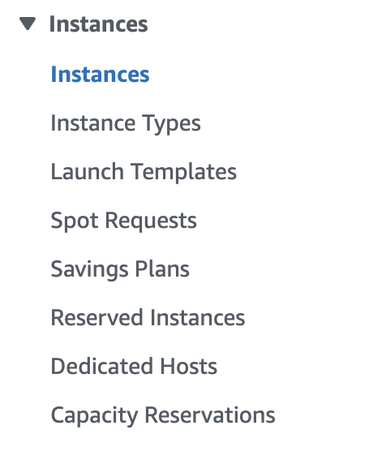
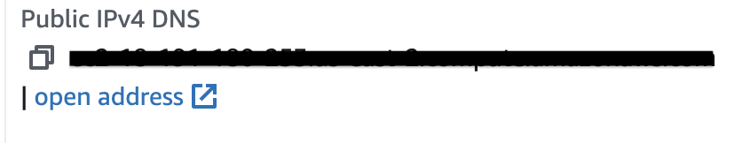

## Provisioning an EC2 instance
We can follow these steps outlined [here](https://docs.aws.amazon.com/AWSEC2/latest/UserGuide/launching-instance.html) to launch an EC2 instance, our "rented" computer.

Obviously, there might be a lot of foreign terminology in that link to understand so we will break it down, and use that link for reference.

### Signing in and getting to EC2 page
1. Sign Up/Sign in to AWS and navigate to the console
2. Click on `EC2`, if you do not see it, you can search for it in the search bar, and then click on it
3. On the left side panel, you should see a section labeled `Instances`, click on `Instances` under that section



4. Click on `Launch instances` on the top right corner to start configuring your EC2 instance

### Launching EC2 instance
1. Creating a unique name for your EC2 instance (typing it into the name section)
2. Choose the `Ubuntu` machine image, under the `Application and OS Images (Amazon Machine Image)` section. This will be the Linux distro we will use, as it is one of the most popular
3. Under `Key pair (login)` create a key for yourself. This helps with security of your instance
4. Click Launch instance and now wait for your EC2 instance to become ready!


You should those 2 green check marks that indicate your instance is ready for use.

### Connecting to our instance
If all the steps were followed in the previous section you should be ready to connect to your EC2 Linux instance. This is achievable via the `ssh` protocol. SSH is a commucation protocol that allows for users to access a secure shell on a remote machine from their machine. You can read more in detail about it [here](https://en.wikipedia.org/wiki/Secure_Shell).

If you are on a Windows machine, you can use an SSH client such as PuTTY, downloadable [here](https://www.chiark.greenend.org.uk/~sgtatham/putty/latest.html). On a Mac machine, you can use the `ssh` command from the `Terminal` application.

You have to locate the private key on your machine which you created and downloaded on the AWS console for your connection to be successful to the rented machine. There might be some file permissions issues with the private key you have to deal with to succesfully connect as well.

The command should look something like:
```bash
$ ssh -i ./path/to/private_key ubuntu@{Public IPv4 DNS}
```

The value for `Public IPv4 DNS` is locaated on the same page where you clicked `Launch Instances` to create your EC2 instance. If you click on the checkbox for your instance that you've created, on the lower bottom third of the page you should see a wealth of information specific to your instance. There should be a section that says `Public IPv4 DNS`, and you can copy and paste that value.



If everything works correctly, you should be prompted to verify your fingerprint on the server, which you should say `yes` to. And you'll then be officially connected to your Linux machine!