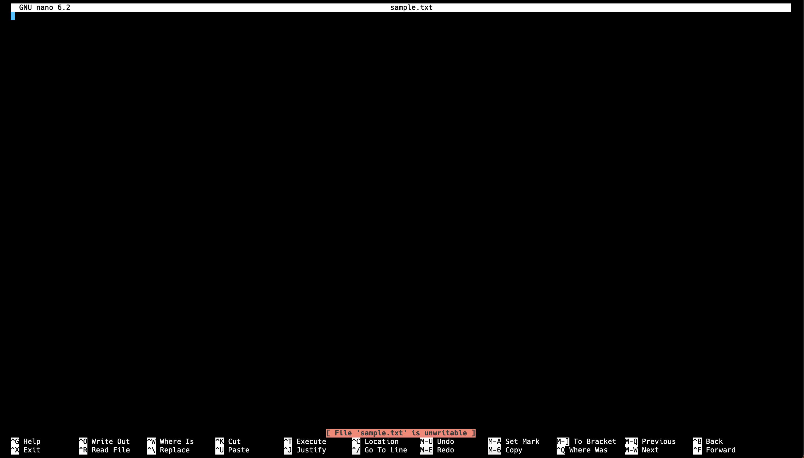

## File permissions

This is probably one of the more important topics in Linux, mainly because a lot of other important topics branch out from it. Linux is particular about security, and the more you are security conscious when utilizing your Linux machine, the better off you are as a DevOps engineer. From the command line execute the following:

```bash
$ whoami
```

This command will display to you the user that is currently logged onto the Linux machine. So for every file you create/edit, program you execute, etc, Linux will do those tasks as the current user that is logged in. Let's examine this in action.

Create a file named `sample.txt` in the home directory, and execute a long listing command again `ls -l`. Now instead of the number of bytes in the file, I want you to take note of two `ubuntu`s in the output, and the funny business on the left that looks like `-rw-rw-r--`.

The first `ubuntu` in that output represents which user owns the file/program, and the second `ubuntu` represents which group the file belongs to. The `-rw-rw-r--` represents the permissions associated with the file in regards to who can do what with the file.

If there is a `d` instead of a `-` for the first character, that represents a directory. The next 9 (potential dashes) could be a combination of the letters `r`, `w`, and `x`. These mean read, write, and execute respectively.

The first 3 group of potential `rwx` represents what permissions are granted to the owner on the file. The second group represents what permissions are granted to the group that this file belongs to. The third group represents the permissions for everyone else on the file.

Knowing this you can start making logical decisions on the permission structure of files and programs you create. Asking questions like:

- Do I want "everybody" that is not me to be able to execute this program?
- Do I want to the be the only one that is able to write to this text file?

Are the right questions to ask to adopt a security conscious when doing any task.

Asking the right questions is one thing, but how do we go about implementing the answer? How do we change permissions of a file to our liking? Or how do we change the owner of a file?

### Changing permissions of a file
`chmod` is the command used for manipulating file permissions for the 3 groups on a file. Chmod permissions changes are represent in mainly 2 different ways. Lets look at both ways.

In the first way you should know a few different characters. `u` stands for user/owner, `g` stands for group, and `o` stands for all others. Once you know these characters plus the characters that stand for read `r`, write `w`, and execute `x`, changing permissions becomes relatively simple.

**Changing `sample.txt` to remove read permissions on the group**
```bash
$ chmod g-r sample.txt
```

**Changing `sample.txt` to grant write permissions to everybody else**
```bash
$ chmod o+w sample.txt
```

**Changing `sample.txt` to grant execute permissions to the owner**
```bash
$ chmod u+x sample.txt
```

**Changing `sample.txt` to remove write permissions for the user and group**
```
$ chmod ug-w sample.txt
```

Simple enough right? You should run the `ls -l` command after ever command and see how the permissions have changed.

Now lets see this practically. Let's remove write permissions for `sample.txt` for the user, and try to edit `sample.txt` in `nano`.

```bash
$ chmod u-w sample.txt
```

Then let's use `nano` to try and edit `sample.txt` and see the error on the bottom. 



Let's now change the `sample.txt` back to have write permissions for the user, to revert back to the initial permissions.

```bash
$ chmod u+w sample.txt
```

### Numeric representation for permission changes
You can [reference](https://www.pluralsight.com/blog/it-ops/linux-file-permissions), to know about the numeric permission codes.

- `7`: `rwx`
- `6`: `rw-`
- `5`: `r-x`
- `4`: `r--`
- `3`: `-wx`
- `2`: `-w-`
- `1`: `--x`
- `0`: `---`

You can use a mix and combination of these numbers to manipulate permissions for the 3 groups. Lets look at a an example:

```bash
$ chmod 444 sample.txt
```

This command will give `read` permissions to the owner of the file, group, and everybody else. The first `4` represents which permissions should be allocated to the owner. The second `4` represents permissions allocated to the group. The third `4` represents permissions allocated to everybody else. Let's look at another example:

**Change owner to have `rw`, group to have `r`, and everybody else `r`**
```bash
$ chmod 644 sample.txt
```

Now that you know two ways to manipulate permissions for files, you can use whichever way you feel comfortable with.

### Changing owner of a file
`chown` is the command used for transferring ownership and group(s) of a file. Let us look at this in action:

```bash
$ chown root sample.txt
```

Uh oh! This command did not work 😞. You should have seen this error:

```
chown: changing ownership of 'sample.txt': Operation not permitted
```

This is because there is only one user on the Linux OS that can change ownership of files, and that is the `root` user. The `root` user considered a superuser account on Linux. It is mainly responsible for administrative purposes, and usually has the highest access rights on the whole system. The `chown` command we tried to execute above was executed as the current user logged in `ubuntu`, which is not the `root` user, and the reason why the command failed.

Luckily, there is a way to execute commands as the `root` user on a Linux machine. If you precede any command with the word `sudo`, it will execute the command as a superuser. So let us revisit the `chown` command.

```bash
$ sudo chown root sample.txt
```

This should most likely succeed since there is no password for our user. If you do a long listing for the directory now you should have seen the owner of the file changed.

```bash
$ ls -l
total 0
-rw-rw-r-- 1 root ubuntu 0 Jul  1 22:49 sample.txt
```

Now, you see the owner of the file is not `ubuntu` anymore, but it is `root`.

Let's now change the `owner` and `group` of the file:

```bash
$ sudo chown root:root sample.txt
```

This command should successfully change both owner and group for the `sample.txt`. Do a long listing and verify that this has changed:

```bash
$ ls -l
total 0
-rw-rw-r-- 1 root root 0 Jul  1 22:49 sample.txt
```

The output should look like above. Now lets change the ownership back for a user and group to `ubuntu`.

### Changing ownership significance
This again is all about security. Because now you can specify things like "Users who are not `ubuntu` should not be able to edit `ubuntu` owned files" for instance.