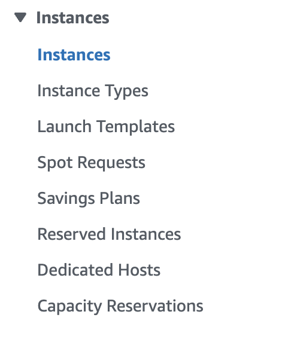

# Linux

Learning Linux one of the most important basis of any practical IT job, and DevOps engineering is no expection to that.

What is the reason for that? Well, according to this [article](https://www.enterpriseappstoday.com/stats/linux-statistics.html#:~:text=Linux%20is%20used%20to%20power,the%20world's%20top%20web%20servers.&text=In%20fact%2C%2096.3%25%20account%20for,%25), Linux powers around 96.3% of the worlds top web servers. To put it simply, it is the king OS of the internet.

However, why is Linux so popular when it comes to the internet and why is it needed for the DevOps profession?

This is what we will learn in this module, as well as actually spinning up a Linux machine for our own personal use.

## Why Linux?
In my opinion, the biggest reason why Linux is the preferred OS to any other OS when it comes to the internet is because of the open-source nature of the OS.

You can actually find all of the source code for Linux on the web [here](https://github.com/torvalds/linux). The code being open-source allows for anybody to run it, build on top of it, and create a forks/variants of Linux. This has already been done many many times, as these variations are called Linux [distributions](https://en.wikipedia.org/wiki/List_of_Linux_distributions) or distros (for short).

These distributions of Linux are sometimes optimized for certain things. For instance, Kali Linux is a distribution that comes with a lot of pre-installed tools to help users get started with penetration testing and ethical hacking. Another example is Alpine Linux, which is a super lightweight distribution without a lot of pre-installed software optimized for simple use cases, like users just wanting to run their own processes. Alpine is super popular in the microservices world (which we will learn about later).

With OSs like Windows, and MacOS, these are closed source offerings and are actually pretty expensive to run. You can read more in depth about the differences between the three OSs [here](https://www.makeuseof.com/linux-vs-mac-vs-windows-operating-system/#:~:text=Unlike%20Windows%20and%20macOS%2C%20Linux,can%20install%20on%20older%20PCs.).

## Getting started with Linux
There are many ways to get started with using Linux. We will be discussing three options here:

First way is to install Linux directly on your host computer. This allows for the operating system software to interact directly with hardware, and allows for full control over the OS on your host. Downside to this approach is that it is more technically inclined, and can be a bit overkill for people who want to do simple things with Linux.

Second way is to install Linux in a virtual machine on your host computer. We will learn more about virtualization in a later module, but for purposes of this lesson it is basically a software level computer, or an OS running in an application. Virtual Machines allow for isolation from the host machine in a variety of ways. It is much simpler then installing Linux directly on a physical host, but they can in some cases be less efficient to run then directly on the host. So it all depends on the use case of your needs.

The third way, and the way we will use for this lesson, is to basically "rent" a Linux machine. Cloud companies such as AWS, Google Cloud Platform, and Azure have ways for people to borrow compute from their infrastructure. Luckily, AWS has a free tier which we can get started with [here](https://aws.amazon.com/ec2/pricing/#:~:text=As%20part%20of%20the%20AWS,use%20only%20EC2%20Micro%20instances.). Renting a machine is perfect for learning since we just want to learn the basics of Linux, but obviously if you have more hefty demands in regards to how you want to use your machine, this may not be the best option. The reason being the free tier is obviously limited.

## Provisioning an EC2 instance
We can follow these steps outlined [here](https://docs.aws.amazon.com/AWSEC2/latest/UserGuide/launching-instance.html) to launch an EC2 instance, our "rented" computer.

Obviously, there might be a lot of foreign terminology in that link to understand so we will break it down, and use that link for reference.

### Signing in and getting to EC2 page
1. Sign Up/Sign in to AWS and navigate to the console
2. Click on `EC2`, if you do not see it, you can search for it in the search bar, and then click on it
3. On the left side panel, you should see a section labeled `Instances`, click on `Instances` under that section



4. Click on `Launch instances` on the top right corner to start configuring your EC2 instance

### Launching EC2 instance
1. Creating a unique name for your EC2 instance (typing it into the name section)
2. Choose the `Ubuntu` machine image, under the `Application and OS Images (Amazon Machine Image)` section. This will be the Linux distro we will use, as it is one of the most popular
3. Under `Key pair (login)` create a key for yourself. This helps with security of your instance
4. Click Launch instance and now wait for your EC2 instance to become ready!


You should those 2 green check marks that indicate your instance is ready for use.

## Connecting to our instance
If all the steps were followed in the previous section you should be ready to connect to your EC2 Linux instance. This is achievable via the `ssh` protocol. SSH is a commucation protocol that allows for users to access a secure shell on a remote machine from their machine. You can read more in detail about it [here](https://en.wikipedia.org/wiki/Secure_Shell).

If you are on a Windows machine, you can use an SSH client such as PuTTY, downloadable [here](https://www.chiark.greenend.org.uk/~sgtatham/putty/latest.html). On a Mac machine, you can use the `ssh` command from the `Terminal` application.

You have to locate the private key on your machine which you created and downloaded on the AWS console for your connection to be successful to the rented machine. There might be some file permissions issues with the private key you have to deal with to succesfully connect as well.

The command should look something like:
```bash
$ ssh -i ./path/to/private_key ubuntu@{Public IPv4 DNS}
```

The value for `Public IPv4 DNS` is locaated on the same page where you clicked `Launch Instances` to create your EC2 instance. If you click on the checkbox for your instance that you've created, on the lower bottom third of the page you should see a wealth of information specific to your instance. There should be a section that says `Public IPv4 DNS`, and you can copy and paste that value.


If everything works correctly, you should be prompted to verify your fingerprint on the server, which you should say `yes` to. And you'll then be officially connected to your Linux machine!

## Linux commands
Knowing linux is all about knowing your way around the terminal/command line. The terminal is an application that allows the user to interact with a variety of things on the machine. Things such as directories, files, executable programs. As a DevOps engineer the terminal is where you will probably spend a majority of your day, so it helps to get very comfortable with it.

The practicals in this section are expressed independently, meaning we assume your machine is in a new state every time.

### Directories and Files (Basics)
**Listing contents of a directory**
```bash
$ ls
```

**Creating a directory**
```bash
$ mkdir newdir
```

**See which directory you are currently working from**
```bash
$ pwd
```

**Creating a file**
```bash
$ touch newfile.txt
```

**Change current working directory**
```bash
$ cd {directory_name}
```

The commands above are basic ones that relate to navigating your machines directory structure. Knowing your way around a Linux machine in the terminal is very useful.

(**NOTE**: Most of these commands assume relative path if you do not provide an absolute path, so it will execute in terms of the `pwd`.)

(**NOTE**: The `.` refers to the current working directory while `..` refers to the parent of the current working directory. So if you want to change your working directory to its parent you should use the command `cd ..`.)

### **Practical**
1. Check your current working directory and verify that it is `/home/ubuntu`, the terminal aliases this directory to `~`, so you will most likely see that on your terminal prompt
2. Create a new directory inside `/home/ubuntu`, and call it by your first name. In my case, the directory will be called `yoofi`
3. Change your working directory to the folder you just created
4. Verify that your working directory has changed, you should see the output be `/home/ubuntu/{first name}`
5. Create a file in this working directory called `{last-name}.txt`, using your specific last name
6. List the contents under your working directory

If you see `{last-name}.txt` as output to your terminal, you've done it correctly! 🎉

### Directories and Files (Basics cont.)
**Copy a file from one location to another**
```bash
$ cp {source} {destination}
```

**Move (or rename) file from one location to another**
```bash
$ mv {source} {destination}
```

**Remove a file**
```bash
$ rm {file_name}
```

### **Practical**
1. Create a file in your home directory (`/home/ubuntu`) named `copy.txt`
2. Create a directory named `{first-name}` from your home directory
3. Copy `copy.txt` to `{first-name}` directory
4. Verify that `copy.txt` exists in your home directory and in the `/home/ubuntu/{first-name}` directory
5. Create a file in your home directory named `move.txt`
6. Move `move.txt` to the directory you have created
7. Verify that `move.txt` does not exist in the home directory, but in the directory that you have created
8. Change directory to `{first-name}` and remove `move.txt`

### Editing Files
Now that we have learned how to create files, it would be way cooler if we can actually do something with the file. If you have very seen engineers work, you have most likely seen that they spend a good amount of there day writing code on something. That something is called a text editor. Some text editors are optimized for different use cases, and some are a bit more barebones allowing the user to configure it to their hearts desires.

Natively, on any Linux machine there exists two text editors by default (`nano`, and `vi`). For now we will use `nano` to edit text since we are editing flat text files. Once you start to write some code, and automate some things, `vi` may be a better option, due to its configurability.

Before we open a file in the `nano` editor to manipulate it, let us examine some deeper details about a file. Let us first create a file named `sample.txt` in the home directory. Then execute the command `ls -l`. You should see output like the following:

```bash
$ ls -l
total 0
-rw-rw-r-- 1 ubuntu ubuntu    0 Jul  1 00:00 sample.txt
```

There is a lot to look at here, and we will revist these details soon. The important thing to note of the output right now is the number `0` which is to the right of the word `staff`. That number is the size of this file. Obviously, this file is empty since we have only created it, but lets see what happens to that number once we add some things to the file.

Open `sample.txt` in the `nano` text editor via the command:

```bash
$ nano sample.txt
```

This should bring you to another view on the terminal. In this view, you can start adding text, just as you would any other word document. Type in the phrase "Hello World!", and save the file (`Ctrl-O`). The `nano` editor will ask you where you would like to save the file, if it says `sample.txt` just hit `return`. After the file successfully saved, you can exit the editor via (`Ctrl-X`), and this should bring you back to the regular terminal view.

We have succesfully edited our first (of many) file(s) on Linux! 🎉

Before we examine the long listing (`ls -l`), let us learn one very important command which allows us to view the contents of a file.

```bash
$ cat sample.txt
```

As you execute this command, you should see the output on your screen as `Hello World!`. This allows us to further verify that the contents of what we wanted to write to the file was actually successfully saved.

Let us now revist the `ls -l` command. You should now see this:

```bash
$ ls -l
total 4
-rw-rw-r-- 1 ubuntu ubuntu    13 Jul  1 00:00 sample.txt
```

The number `13` represents how many bytes are in the file it is referring to. In our case there are 12 characters, and one carriage return under `Hello World`, which is the 13th character.

### **Practical**
1. Create a file named anything you want in your home directory
2. Edit the file you have just created and type in the days of the week with a new line in between each day
3. Create a new directory from your home directory named anything you want
4. Move the file you have edited to the directory you created in the previous step
5. Verify that the amount of bytes in the file are what you expect. Should be `57`

### File permissions
This is probably one of the more important topics in Linux, mainly because a lot of other important topics branch out from it. Linux is particular about security, and the more you are security conscious when utilizing your Linux machine, the better off you are as a DevOps engineer. From the command line execute the following:

```bash
$ whoami
```

This command will display to you the user that is currently logged onto the Linux machine. So for every file you create/edit, program you execute, etc, Linux will do those tasks as the current user that is logged in. Let's examine this in action.

Create a file named `sample.txt` in the home directory, and execute a long listing command again `ls -l`. Now instead of the number of bytes in the file, I want you to take note of two `ubuntu`s in the output, and the funny business on the left that looks like `-rw-rw-r--`.

The first `ubuntu` in that output represents which user owns the file/program, and the second `ubuntu` represents which group the file belongs to. The `-rw-rw-r--` represents the permissions associated with the file in regards to who can do what with the file.

If there is a `d` instead of a `-` for the first character, that represents a directory. The next 9 (potential dashes) could be a combination of the letters `r`, `w`, and `x`. These mean read, write, and execute respectively.

The first 3 group of potential `rwx` represents what permissions are granted to the owner on the file. The second group represents what permissions are granted to the group that this file belongs to. The third group represents the permissions for everyone else on the file.

Knowing this you can start making logical decisions on the permission structure of files and programs you create. Asking questions like:

- Do I want "everybody" that is not me to be able to execute this program?
- Do I want to the be the only one that is able to write to this text file?

Are the right questions to ask to adopt a security conscious when doing any task.

Asking the right questions is one thing, but how do we go about implementing the answer? How do we change permissions of a file to our liking? Or how do we change the owner of a file?

### Changing permissions of a file
`chmod` is the command used for manipulating file permissions for the 3 groups on a file. Chmod permissions changes are represent in mainly 2 different ways. Lets look at both ways.

In the first way you should know a few different characters. `u` stands for user/owner, `g` stands for group, and `o` stands for all others. Once you know these characters plus the characters that stand for read `r`, write `w`, and execute `x`, changing permissions becomes relatively simple.

**Changing `sample.txt` to remove read permissions on the group**
```bash
$ chmod g-r sample.txt
```

**Changing `sample.txt` to grant write permissions to everybody else**
```bash
$ chmod o+w sample.txt
```

**Changing `sample.txt` to grant execute permissions to the owner**
```bash
$ chmod u+x sample.txt
```

**Changing `sample.txt` to remove write permissions for the user and group**
```
$ chmod ug-w sample.txt
```

Simple enough right? You should run the `ls -l` command after ever command and see how the permissions have changed.

Now lets see this practically. Let's remove write permissions for `sample.txt` for the user, and try to edit `sample.txt` in `nano`.

```bash
$ chmod u-w sample.txt
```

Then let's use `nano` to try and edit `sample.txt` and see the error on the bottom. 


Let's now change the `sample.txt` back to have write permissions for the user, to revert back to the initial permissions.

```bash
$ chmod u+w sample.txt
```

### Numeric representation for permission changes
You can [reference](https://www.pluralsight.com/blog/it-ops/linux-file-permissions), to know about the numeric permission codes.

- `7`: `rwx`
- `6`: `rw-`
- `5`: `r-x`
- `4`: `r--`
- `3`: `-wx`
- `2`: `-w-`
- `1`: `--x`
- `0`: `---`

You can use a mix and combination of these numbers to manipulate permissions for the 3 groups. Lets look at a an example:

```bash
$ chmod 444 sample.txt
```

This command will give `read` permissions to the owner of the file, group, and everybody else. The first `4` represents which permissions should be allocated to the owner. The second `4` represents permissions allocated to the group. The third `4` represents permissions allocated to everybody else. Let's look at another example:

**Change owner to have `rw`, group to have `r`, and everybody else `r`**
```bash
$ chmod 644 sample.txt
```

Now that you know two ways to manipulate permissions for files, you can use whichever way you feel comfortable with.

### Changing owner of a file
`chown` is the command used for transferring ownership and group(s) of a file. Let us look at this in action:

```bash
$ chown root sample.txt
```

Uh oh! This command did not work 😞. You should have seen this error:

```
chown: changing ownership of 'sample.txt': Operation not permitted
```

This is because there is only one user on the Linux OS that can change ownership of files, and that is the `root` user. The `root` user considered a superuser account on Linux. It is mainly responsible for administrative purposes, and usually has the highest access rights on the whole system. The `chown` command we tried to execute above was executed as the current user logged in `ubuntu`, which is not the `root` user, and the reason why the command failed.

Luckily, there is a way to execute commands as the `root` user on a Linux machine. If you precede any command with the word `sudo`, it will execute the command as a superuser. So let us revisit the `chown` command.

```bash
$ sudo chown root sample.txt
```

This should most likely succeed since there is no password for our user. If you do a long listing for the directory now you should have seen the owner of the file changed.

```bash
$ ls -l
total 0
-rw-rw-r-- 1 root ubuntu 0 Jul  1 22:49 sample.txt
```

Now, you see the owner of the file is not `ubuntu` anymore, but it is `root`.

Let's now change the `owner` and `group` of the file:

```bash
$ sudo chown root:root sample.txt
```

This command should successfully change both owner and group for the `sample.txt`. Do a long listing and verify that this has changed:

```bash
$ ls -l
total 0
-rw-rw-r-- 1 root root 0 Jul  1 22:49 sample.txt
```

The output should look like above. Now lets change the ownership back for a user and group to `ubuntu`.

### Changing ownership significance
This again is all about security. Because now you can specify things like "Users who are not `ubuntu` should not be able to edit `ubuntu` owned files" for instance.

## Adding and Deleting users

Up until this point we have seen two users on the system, `ubuntu` and `root`. We know the purpose of `root` being the super user, to do things on the system that are likely prohibited for other users.

The `ubuntu` user is the user we have created the machine with, and is the only non-root/regular user on the system.

What if we had use cases of using different users on the system, how would we go about creating these users. Also, if we no longer have any use for a particular user on a system, how do we go about deleting that user off of the system, and all of the semantics behind that.

### Which users already exist?

First, let us check which users already are on the system. We can view this by the following command:

```bash
$ cat /etc/passwd
```

This command will show output similar to the following:

```bash
root:x:0:0:root:/root:/bin/bash
daemon:x:1:1:daemon:/usr/sbin:/usr/sbin/nologin
bin:x:2:2:bin:/bin:/usr/sbin/nologin
sys:x:3:3:sys:/dev:/usr/sbin/nologin
sync:x:4:65534:sync:/bin:/bin/sync
games:x:5:60:games:/usr/games:/usr/sbin/nologin
man:x:6:12:man:/var/cache/man:/usr/sbin/nologin
lp:x:7:7:lp:/var/spool/lpd:/usr/sbin/nologin
mail:x:8:8:mail:/var/mail:/usr/sbin/nologin
ubuntu:x:1000:1000:Ubuntu:/home/ubuntu:/bin/bash
...
```

There are definitely many more entries than what is listed above, but let us examine this bit of output. There are three types of users on a Linux system overall: super or root user, system users, and normal users.

Super/root user is a user that has the most permissions to do certain actions on a Linux machine. The home directory for this user is `/root`, and it operates with the `/bin/bash` shell. This was already created by the Linux machine as it was provisioned. So a the super user in this output is `root`, as we have learned before.

System users are users who are created by other software and applications. You can usually tell which is a system user by their shell: `/usr/sbin/nologin`. This means that system users are unallowed to login to our machine.

Normal users are users that are created by the root user. It was a transparent process, but when we provisioned/initialized our Linux machine, the root user actually created the `ubuntu` user behind the scenes, and is now the default user we use to login to the Linux machine.

Now let's get to the fun part by adding and deleting users.

### Adding a user

There are a couple commands that allow you to create a user on the system, but we will look at just one, which will work on most Linux systems.

**Adding a user**
```bash
$ sudo useradd abena -m -s /bin/bash
```

Let's break this command and all of its flags down one by one. `abena` is the user we want to add, you can replace this with any name or whatever you want to create.

The `-m` flag is what instructs the command to create a home directory for the user with the users name. So, in this scenario the directory `/home/abena` will be created.

The `-s` flag specifies which shell should be assigned to the user when you login what that user. In this case, we use the very popular shell `/bin/bash`.

You can go ahead and give that a try and see if everything was created right. Here are some commands to verify.

```bash
$ cat /etc/passwd
```

This should show some output, basically showing a line like this:

```bash
abena:x:1001:1001::/home/abena:/bin/bash
```

You should also see that a home directory was created:

```bash
$ ls /home
```

This should output a line that indicates it has found an abena entry from listing out the home directory.

### Switching users

To switch users from the command line, you can use the simple command `su`.

```bash
$ sudo su abena
```

Executed successfully, this should change your terminal prompt to include `abena` instead of `ubuntu` in the very beginning. You can further verify that you are switched to abena by checking "who you are"? Remember the command for that `whoami`.

```bash
$ whoami
```

If you see abena here, you have successfully switched over to the abena user. To go back to `ubuntu` since this brought up a different shell, you can just type in `exit`.

With the user abena, you can do everything that we did with `ubuntu`, and all the same file permission semantics apply.

### Deleting users

To delete a user you can use the following command:

**Delete a user**
```bash
$ sudo userdel -r abena
```

This is a pretty simple command, the `-r` flag tells the `userdel` command to delete the home directory for that user as well.

To verify that the user has been deleted, you can verify in all the places we checked to see existence of the user. `cat /etc/passwd`, and `ls /home`.

### Significance of adding and deleting users

These commands are particularly useful for a Linux system administrator managing a whole bunch of users in an organization on a Linux machine, and their permissions for certain files, programs and such.

## Processes

As you execute a command or start up any program on Linux, it will run that as a process. All processes have a lifetime in Linux and goes through various stages during its lifetime. Some processes are more long lived then others. For instance a `nginx` web server (of which we'll learn in a later module) is an infinite process, and can only be stopped if it is externally killed. A command like `ls` is a short lived process as it only prints out some information back to us as we prompt the command line.

We can view all running processes by running `ps aux`. There is going to be a lot of output that consist of numbers time stamps, etc. The important things to note for content we have already learned is the `USER` column. This indicates the user that owns the process that is running. The other thing to note which is new is the `PID` column.

Linux assigns unique identifiers for every process that runs on the machine, and this is what the `PID` is. Once you know the `PID` of a process, you can start to issue different signals to that process from the command line. You can view the different most of the different signals [here](https://faculty.cs.niu.edu/~hutchins/csci480/signals.htm). Let's look at a couple examples:

- `SIGINT`: terminate a program from the terminal. This is generated by pressing Control-C
- `SIGKILL`: terminate the process forcibly at once. This can be done by the command `kill -9 {PID}`
- `SIGTERM`: terminate process gracefully. This can be done by the command `kill {PID}`

Knowing this, if you spot a process on your machine that you want to terminate, you can do that.

Let us now see some of this in action...

On your Linux machine, we will type in the command:


```bash
$ sleep 30 &
```

What this will do is actually suspend a process for the specified amount of time. The `&` character tells Linux to run this process in the background so we can execute more commands since we only have one terminal prompt.

If you were to run the command without `&`, then your terminal will suspend for 30 seconds and you would not be able to type anything in the terminal until those 30 seconds are up.

Now that we have a process that has been initiated, let us view that process with `ps`.


```bash
$ ps aux | grep sleep
```

There are a few important concepts here, but basically what this command is saying in English is "Give me all the running processes on the machine and filter that output for the process `sleep`".

Technically, what is happening, is `ps aux` by default is outputting to what we call `stdout`. The `|` (pipe) character is saying feed this `stdout` output as `stdin` input to the `grep`, command. The `grep` command is for filtering and displaying text from a source. In this case the source happens to be the output of the `ps aux` command.

You can read more about piping/using the pipe character [here](https://www.geeksforgeeks.org/piping-in-unix-or-linux/), and about `stdin`, `stdout`, etc [here](https://www.howtogeek.com/435903/what-are-stdin-stdout-and-stderr-on-linux/).

For now, the output of the command above should have printed out something like this:

```bash
$ ps aux | grep sleep
ubuntu    195068  0.0  0.1   6188  1028 pts/0    S    14:35   0:00 sleep 30
ubuntu    195141  0.0  0.2   7004  2268 pts/0    S+   14:35   0:00 grep --color=auto sleep
```

The first line is actually the `sleep` process we've executed in the background the command before. The second line is actually the command we just executed. As you can see, the PID here is `195068`, and the user who owns the process is `ubuntu`, which makes sense. So you can actually kill this process if you want to, or just leave it running, but this is all to show the control you have over the lifetime of processes that are running on your Linux machine.

### Resources
Each process in Linux is subject to consume machine resources as necessary. There are three main resources on the machine: CPU, RAM, and disk space. The OS is in charge of determining how resources will get shared amongst processes.

If we type in `ps aux` there two columns to be of note here: %CPU, and %MEM. The %CPU is the amount of CPU that is allocated to the process at the time you executed the `ps aux` command. The same is true for %MEM, but it is the amount of RAM that the process is using.

The `ps aux` is basically a snapshot in time (when you execute the command) of the state of processes and what they are using. This is not particularly useful as processes are always changing in state, and the OS is constantly determining which resources to allocate to the processes. Therefore, Linux has another command we can use for the constant monitoring of processes on the machine: `top`.

```bash
$ top
```

`top` also shows the same information that `ps aux` shows, but it is a long running process that constantly updates. Right now, there is not much going on since there are not many active processes that are running on the machine, but you should see some amount of activity happening, and things changing a bit.

How can we make this more interesting? Because the point of having a machine is for it to be utilized. The machine can be used as a web server to serve content to clients as they request for it. It can also be used for some process that runs on a schedule, etc.

In future modules, we will learn how to do exactly that.

## What's next?
This was a doosy of a lesson, but very important and fundamental, because without this knowledge it will be hard to do anything else in regards to DevOps engineering.

Next, we will learn about networking: how the internet works, and how networking works from and to a Linux machine.

## Interview Questions
1. Which command can your run to find out your current working directory?
2. What is a Linux distribution?
3. What does `ssh` stand for and why is it important?
4. How would you go about finding who owns a certain process?
5. I run a process that is writing to a file, and the writes are getting "Permission denied" errors, what would you check?
