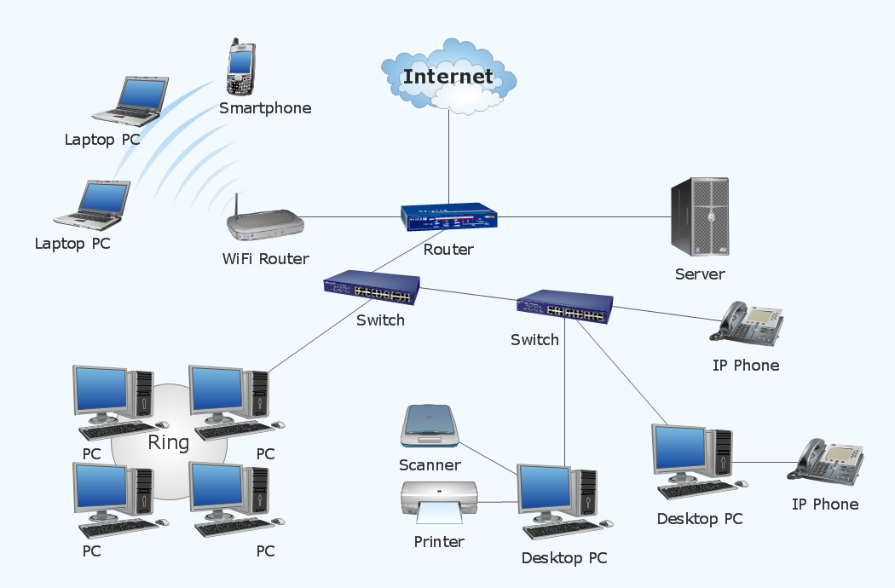

## General Knowledge

Before diving into Linux commands and examining things on our Linux machine, it is important to acquire some general knowledge on networking as a whole and how a network is set up.



Looking at the diagram above let us break down all the parts of it.

### Devices

The devices you see in the diagram come in all forms. You see Laptop PCs, a smartphone, Desktop PCs, Printers, Servers, Switches, Routers etc. All these devices have network interfaces from which they can send or receive network traffic.

### Switches

A switch is an intelligent device that connects two or devices to each other within a LAN (Local Area Network). It can forward data packets from one device to another device, from what we have deinfed above. You can see in in a typical network setup, that switches are usually connected to a router for communication with another network.

You can read more detail about network switches [here](https://www.cloudflare.com/learning/network-layer/what-is-a-network-switch/).


### Routers

A router is a layer above a switch, as a switch is intended to connect two or more devices to each other to form a LAN, a router is a device that can connect two or more networks together. So packet data from a device as it arrives at a router, the router will figure out the best way to send that packet data to a destination which is usually another LAN located somewhere. From this diagram, the other LANs are located out on the web (internet).

You can read more detail about routers [here](https://www.cloudflare.com/learning/network-layer/what-is-a-router/).

### IP Addresses

IP Addresses are 4 `.` delimited numbers that can range between 0-255. Essentially, the range of IP Addresses are from 0.0.0.0 to 255.255.255.255.

IP stands for (Internet Protocol), and these contain a set of rules that allow the possibility of devices communicating over a network. Each device that wants to communicate over a network is assigned an IP Address. In this case from the diagram, each device that is connected to the router will be assigned an IP address.

IP Addresses are actually how two devices communicate with each other over the internet from different networks.

#### Public vs. Private IP Addresses

Each device that is connected to a router provided by an ISP is going to be assigned an IP Address, and this is usually the private IP. The router needs a way to address the devices in the network, and this is done through private IP Addressing.

Public IP addresses are the primary address associated with your whole network. The public IP Address will be assigned by your ISP, and if a device wants to send data packets to your network, they first need to go through the public IP Address.

You can read more detail about IP Addresses and the different types of them [here](https://usa.kaspersky.com/resource-center/definitions/what-is-an-ip-address).

### Protocols

Protocols are nothing but a convention agreed upon by two devices that are trying to communicate with each other. There are many different protocols that devices use to communicate with each other but they mostly are built upon two distinct high level protocols: `TCP` and `UDP`.

**tcp**
- Requires an established connection before transmitting data (dialing to another computer)
- Can retransmit data
- Delivery to destination is guaranteed
- Slower than udp, but tradeoff is complete data delivery
- HTTP, HTTPS, FTP are built upon TCP

**udp**
- No connection is needed
- No data retransmitting
- Delivery is not guaranteed
- Faster that tcp, but at risk of data loss between machines
- DNS, DHCP, ARP are built upon UDP

In most cases through our modules we will be concerning ourselves with TCP, since we will see many scenarios of HTTP(s) communication.

### Network Ports

Without getting into too of the low level details of what ports are, for our purposes you can think of them as software-defined numbers where computers can receive traffic from another computer. Port numbers typically range from 0 - 65535. More specifically, if you want to send data to another computer you usually have to provide at the minimum two pieces of information, the IP Address and the port, and they look like this together:

```
192.168.10.3:8000
```

If another computer is trying to send traffic to what is stated above, they are going to send traffic to port `8000` on the computer that has the IP Address `192.168.10.3`, the separator is always the colon `:`.

Common port numbers for protocols:

`80`: HTTP
`443`: HTTPS
`22`: SSH