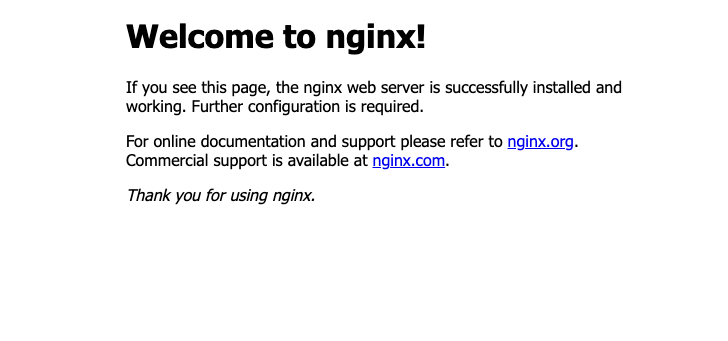

## Web Server

### Nginx

`nginx` is a general-purpose web server. It can be used for a variety of use cases, to serve static content back, as a reverse proxy/load-balancer. In a lot of cases, it is used as the front door for all web traffic coming into what ever application you are operating.

At that level, you have a lot of control as far as where to route the traffic after it hits `nginx`, add special headers to each request that comes in, and the list goes on and on. For our purposes, we will get started by installing it, and then running it on our machine for clients to start making requets onto our machine.

### Installing `nginx`
To install `nginx` we have to use the `apt` packaging system. `apt` is basically a tool for installing software from a remote location (repository).

```bash
$ sudo apt update && sudo apt install nginx
```

After a few steps you should have `nginx` now installed on your machine. Now lets do something with `nginx` (aka. start the server).

**Start the `nginx` web server**
```bash
$ sudo nginx
```

The `nginx` command needs to be ran as the superuser, because it is trying to listen on a port 80 which is below 1024, there are more details [here](https://security.stackexchange.com/questions/202861/is-it-a-security-risk-to-run-master-process-of-nginx-as-root#:~:text=One%20reason%20to%20run%20nginx,not%20needed%20in%20your%20case.) as to why that is important.

If there was no output, that means your `nginx` server has successfully been started! Now lets see how we can reach our `nginx` from another computer.

Go to your host computer and type in the browser this: `http://{Public IPv4 DNS}`. You should see a screen like this:



We have successfully gotten our machine to serve back some content back to a requesting client. A huge step actually!

In more techincal terms, `nginx` starts a web server that will listen on the `http` port which is the standard port number `80` on every machine. When you visit the `http://{Public IPv4 DNS}` without specifying a port number you are going to communicate with the default port which is `80`.

So basically our machine wants to communicate with the machine hosted at `{Public IPv4 DNS}` on port 80. That makes sense, so then where does the web page actually come from?

If you go back to your linux instance, type in the command:

```bash
$ cat /var/www/html/index.nginx-debian.html
```

You should see some `html` content. These are exacly the words that we've seen on the web page when we communicated with the server wrapped in an `html` file. `html` is what gets rendered in the browser.

If you visit that page a couple of times, you can revisit the `ss` command and see if you can validate that connections to your machine were in fact initiated. Lets examine the output:

```bash
$ ss -rtp
State              Recv-Q              Send-Q                                                        Local Address:Port                            Peer Address:Port               Process
ESTAB              0                   0                                ip-192-168-4-20.us-east-2.compute.internal:http                           68.90.135.182:63055
ESTAB              0                   0                                ip-192-168-4-20.us-east-2.compute.internal:http                           68.90.135.182:63056
```

As you can see the local address has the `http` port of which learned about earlier, and the peer address is my IP on my host machine I am using to communicate with the server running on the EC2 instance.

After everything, you can stop your `nginx` server to clearn up by using the command:

```bash
$ sudo nginx -s stop
```