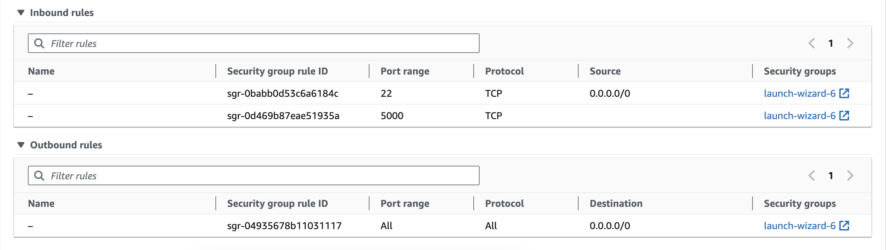

## Networking

You have most likely already, actually 100%, performed some sort of computer networking operation(s) in your life, without even knowing it. The basic idea of computer networking is for one computer to communicate to another usually via the internet, so most of the times computers can not talk to each other without being online.

In your case, the computer network operation you've mostly performed is visiting a website, any website for that matter. If you did not know, when you visit a website, you are most likely communicating if not one at least multiple computers before you see the web page on your end.

Lets say for instance you want to visit `https://www.youtube.com`. What usually happens first is that your request gets routed to your ISP (internet service provider), and your ISP has information on how to translate `https://www.youtube.com` to an IP address. The computers really only understand IP addresses in terms of networking, which we'll talk about later on in this module.

This is probably one of the most important modules when it comes to not just DevOps, but engineering in general. This is because a lot of tech and even non tech companies nowadays run their sofware product across multiple machines. Machines in this setup would need to talk to each other to get relevant information for whatever they need to do, and that by nature is dependent on the network. Also whenever you are dependent on the network for your software to work, anything can happen (failure-wise), which means that you have to account for/monitor these error scenarios. That leads to a big topic of **observability** which in very important in the DevOps world as well, and what we will talk about in a later module.

For now, we will concern ourself on how to examine the network on a Linux machine, and what it is all about.

## Inbound/Outbound Traffic

[Network traffic](https://www.fortinet.com/resources/cyberglossary/network-traffic#:~:text=Network%20traffic%20is%20the%20amount,network%20at%20any%20given%20time.) can go one of two ways from a single machines perspective, inbound or outbound. Inbound traffic is traffic coming into the machine from another computer. Outbound traffic is traffic that goes out from the machine to another computer.

If you recall on AWS EC2 instance page, as you click on a instance and examine it, there are security groups which determine traffic associated with it here:



You can see the inbound and outbound rules. It is here where you can configure which machines are allowed to talk to your EC2 instance, and on which port they are able to talk.

Lets look at a command to examine network statistics on your machine: [ss](https://www.tecmint.com/ss-command-examples-in-linux/).

```bash
$ ss -a
```

This command will print out to the terminal a load of networking information on your machine. There are two main protocols we are interested in `tcp`, and `udp`. The `tcp` protocol is probably the most important protocol for our purposes because it is what one of the most popular protocol `http`, relies on. `udp` on the other has a lot of popular use cases. There is a wealth of sources that exhaustively explain the big differences between the two, but here is a short list.

**tcp**
- Requires an established connection before transmitting data (dialing to another computer)
- Can retransmit data
- Delivery to destination is guaranteed
- Slower than udp, but tradeoff is complete data deliver

**udp**
- No connection is needed
- No data retransmitting
- Delivery is not guaranteed
- Faster that tcp, but at risk of data loss between machines

To filter for `tcp` you can type in the command:

```bash
$ ss -t
```

The output here on a fresh machine (EC2 instance) that isn't running anything should just be one line. This line is actually **very** important. It shows the details of the `ssh` connection that was made from your host machine to the EC2 instance. Lets go column by column:

`State`: This shows the state of the connection. A connection has a lifetime and goes through multiple states during that lifetime
`Recv-Q`: Number of network packets recieved over this connection
`Send-Q`: Number of network packets sent over this connection
`Local Address:Port`: The address and port of the local machine this connection is initiated
`Peer Address:Port`: The remote address and port by which this connection is initiated

If there active processes on your machine you can actually get statistics on which process doing networking as well, using the command with flag:

```bash
$ ss -p
```

You can also combine these commands and declaritively get information for any filter you want.

**Show PIDs for all tcp connections on my machine**
```bash
$ ss -tp
```

**Show all TCP traffic and resolve host names from IP, along with PIDs**
```bash
$ ss -rtp
```

These are all snapshot in time outputs which sort of mimics how the `ps aux` command worked for processes. There is a way to continuously monitor the network and that is the command `tcpdump`. However, before we look at `tcpdump`, we will look at another command `ping` which is one of the most fundamental networking commands on Linux.

## Checking networking connectivity (ping)

`ping` as aforementioned is a basic networking connectivity command which shows your ability to reach a host from your machine.

You can try to reach a popular host and examine the output.

```bash
$ ping www.google.com
```

If you see a constant stream of bytes coming back that indicates that there is connectivity between the two devices. If the command hangs or 0 bytes come back, that means there is some sort of problem of connectivity between the two devices.

This is a very useful command to just know right away if your machine can establish connections to other machines.

## `tcpdump` continous network monitoring

`tcpdump` is another popular command to understand the network through your machine. We can look at it as a more dynamic way of seeing networking output as compared to the `ss` command. Lets see it in action (It needs to be ran as the superuser `sudo`):

```bash
$ sudo tcpdump
```

Well the output of that was way too much to even try and soak in anything useful. By default `tcpdump` will output all things from all the network interfaces on your machine.

As with most things, we are most likely specific in what we are looking for and concerned with a specific use case. So lets filter the `tcpdump` command down some.

```bash
$ sudo tcpdump -c 5 port 22
```

What this command is doing is telling your machine to just capture 5 network packets that are going through the port 22 (inbound and outbound) traffic. The port `22` is standardized as the `ssh` port, so basically the port we used for `ssh` onto a machine. There seems to be continuous packets sent, this is most likely `ssh` acknowledging that the connectivity should still exist.

In modern day technologies, `tcpdump` is usually considered a last ditch effort to understand at the byte level what is going on with the network on a specific machine. There are higher level tools that are used in modern day to examine network activity, but to know how to use `tcpdump` is always to your advantage.

## Practical (Create an app that another computer can network with)

Now it is time for the fun stuff! We are going to learn how to run an application on our machine that other computers can network with.

First, we will run one of the favorites for DevOps engineers, the ubiquitous `nginx` web server. 

### What is `nginx`?

`nginx` is a general-purpose web server. It can be used for a variety of use cases, to serve static content back, as a reverse proxy/load-balancer. In a lot of cases, it is used as the front door for all web traffic coming into what ever application you are operating.

At that level, you have a lot of control as far as where to route the traffic after it hits `nginx`, add special headers to each request that comes in, and the list goes on and on. For our purposes, we will get started by installing it, and then running it on our machine for clients to start making requets onto our machine.

### Installing `nginx`

To install `nginx` we have to use the `apt` packaging system. `apt` is basically a tool for installing software from a remote location (repository).

```bash
$ sudo apt update && sudo apt install nginx
```

After a few steps you should have `nginx` now installed on your machine. Now lets do something with `nginx` (aka. start the server).


**Start the `nginx` web server**
```bash
$ sudo nginx
```

The `nginx` command needs to be ran as the superuser, because it is trying to listen on a port 80 which is below 1024, there are more details [here](https://security.stackexchange.com/questions/202861/is-it-a-security-risk-to-run-master-process-of-nginx-as-root#:~:text=One%20reason%20to%20run%20nginx,not%20needed%20in%20your%20case.) as to why that is important.

If there was no output, that means your `nginx` server has successfully been started! Now lets see how we can reach our `nginx` from another computer.

Go to your host computer and type in the browser this: `http://{Public IPv4 DNS}`. You should see a screen like this:


We have successfully gotten our machine to serve back some content back to a requesting client. A huge step actually!

In more techincal terms, `nginx` starts a web server that will listen on the `http` port which is the standard port number `80` on every machine. When you visit the `http://{Public IPv4 DNS}` without specifying a port number you are going to communicate with the default port which is `80`.

So basically our machine wants to communicate with the machine hosted at `{Public IPv4 DNS}` on port 80. That makes sense, so then where does the web page actually come from?

If you go back to your linux instance, type in the command:

```bash
$ cat /var/www/html/index.nginx-debian.html
```

You should see some `html` content. These are exacly the words that we've seen on the web page when we communicated with the server wrapped in an `html` file. `html` is what gets rendered in the browser.

If you visit that page a couple of times, you can revisit the `ss` command and see if you can validate that connections to your machine were in fact initiated. Lets examine the output:

```bash
$ ss -rtp
State              Recv-Q              Send-Q                                                        Local Address:Port                            Peer Address:Port               Process
ESTAB              0                   0                                ip-192-168-4-20.us-east-2.compute.internal:http                           68.90.135.182:63055
ESTAB              0                   0                                ip-192-168-4-20.us-east-2.compute.internal:http                           68.90.135.182:63056
```

As you can see the local address has the `http` port of which learned about earlier, and the peer address is my IP on my host machine I am using to communicate with the server running on the EC2 instance.

After everything, you can stop your `nginx` server to clearn up by using the command:

```bash
$ sudo nginx -s stop
```

## What's next?

From this lesson, we garnered the very basics of networking, and slight details of what it takes for two machines to network with each other.

We will expand upon this concept in the next module and actually write our own web server. This will expose us to more real world DevOps scenarios.


## Inteview Questions
1. What port does `ssh` run on?
2. Describe to me how computer networking works and what it is.
