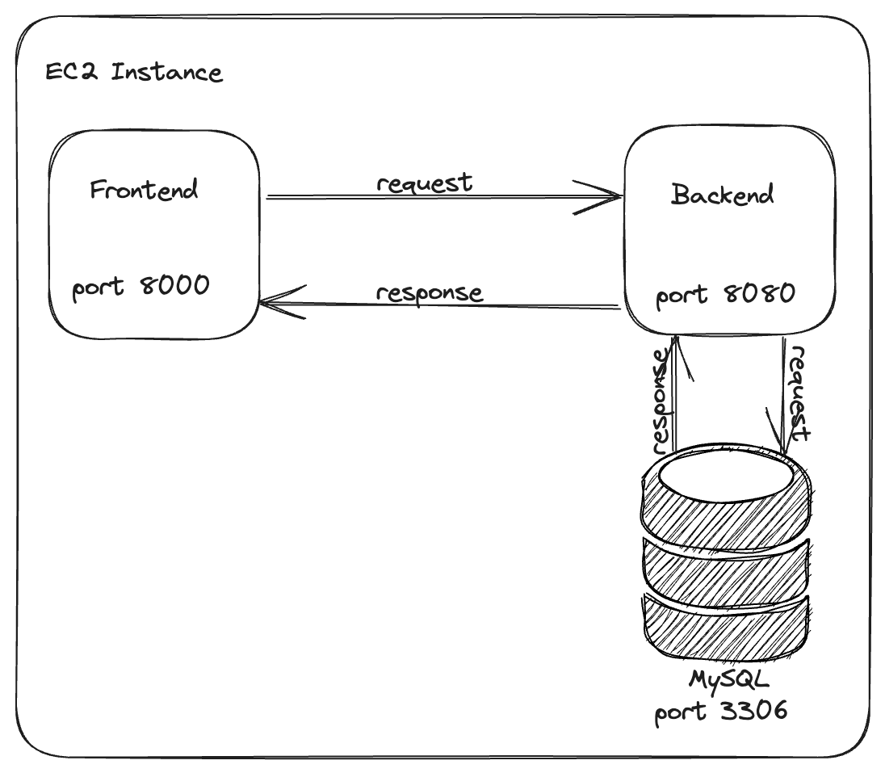
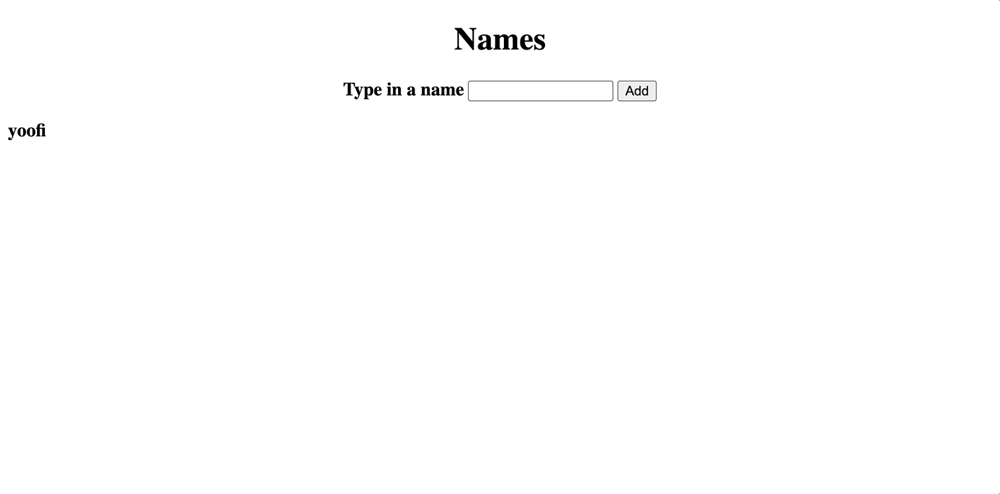

## Getting started running a real application

The backend can be pretty ambiguous and we will talk about different backend architecture methodologies. In this case we will focus on what is called [monolithic architecture](https://en.wikipedia.org/wiki/Monolithic_application). Essentially, there will be one big single process that will run our application on the backend.

The backend application will connect to a database, in this case [`mysql`](https://www.mysql.com/), a very popular database server.

So you can imagine the flow looking like the following:



A user interacts with the front end which will communicate with a backend application, and that will communicate with a database if need be, to return information back to the front end to consume and use.

For example, if you refresh your Twitter feed, you send a request to Twitter's application service, and it will fetch new tweets if need be from the database, and return the data all the way back to you as a user to see.

### Example Application

Under the `app/` directory you will see a series of files and folders. Let's look at these individually:

- `index.html`: static html web page (`html` is the markup language of the internet)
- `js/`: contains the JavaScript code to enable interactivity with the `html` content
- `python/`: contains the backend application code that the `html` interacts with through the `js/` interactivity files, and the bootstrapping files for creating MySQL database tables

With all of these files, it makes up a fully-featured web application with all of the three tiers we have mentioned above (frontend, backend application, and storage).

So the app works like this:



It is simple. You basically add a name and the name displays on the left side of the browser. What is happening underneath the hood is that you input some text into the `html` text box. When you press the `Add` button, the JavaScript code will take that text and send a request to the python backend which handles the request and stores that text into the database (MySQL). You can see the power of the database (persistence) if you close and open the web page. The data we've added is still there, because when the page loads the front end makes a request through the JavaScript code to the python backend to retrieve all of the names from the database and display it on the web page.

#### How to run this application?

You will need to copy these files into our EC2 Linux instance. Unfortunately, up until this point we have not learned automation to make copying files easier, so you will need to do that manually:


> **Expert Tip**:

> If you do have this repository cloned locally you can run the > following command where the `app/` directory is located.

> ```bash
> $ rsync -rav -e "ssh -i {PRIVATE_KEY}" --exclude "**/venv" > app/ ubuntu@{Public IPv4 address}:/home/ubuntu/app
> ```

> The `rsync` command is a pretty powerful one and you can read > more about it [here](https://www.hostinger.com/tutorials/how-to-use-rsync#:~:text=The%20Linux%20rsync%20command%20transfers,command%20to%20improve%20their%20productivity.). Basically, it will copy the > whole `app/` directory into the Linux instance. It does this over `ssh`.

> Do not worry about this too much if you do not have the repository cloned locally. You will learn how to clone repositories in the `Git` module soon enough.

You can then `ssh` into you Linux instance, and edit the `app/js/app.js` file. Wherever it says `${IP_ADDRESS}` you want to remove that and put the IP Address or Public IPv4 DNS name of your Linux instance (this will be different for everybody). Now your application is fully configured and ready to be ran.

Before you run do run anything though, let us revisit the in/outbound rules for your instance. You want to make sure you open up ports `8000`, and `8080` for inbound traffic to the internet. This is because the web server that will serve your HTML content will run on port `8000`, and the python backend server will run on port `8080`. You can revisit the networking module on how to open up in/outbound traffic to a port on your machine.

#### Running the backend (python + MySQL)

We have already seen how to do this in the previous module but lets revisit.

**Step 1:** Installing Python dependencies.

Change directory into `/app/python`, and install the dependencies with the `pip` python package installer.

```bash
$ pip install -r requirements.txt
```

In the end you are going to be running a Python application. The Python application that we are going to be running has "dependencies". These dependencies can be installed in a variety of ways, but one of the more famous ways is to use `pip`. You can read more about what that is [here](https://pypi.org/project/pip/).

**Step 2:** Installing and provisioning MySQL.

From anywhere on your machine, run the following command.

**Note:** Do not worry too much about all the syntax for this step in regards to MySQL. As you get more advanced you will start to understand the concepts of everything that is going on here.

```bash
$ sudo apt install mysql-server
```

If this command failed, try updating the package index again.

```bash
$ sudo apt update
```

If it was successful, the MySQL server should be running on port `3306`. You can confirm that with the commands from the previous module.

Now we have to create a user for MySQL that the python application can make use of.

```bash
$ sudo mysql
Server version: 8.0.34-0ubuntu0.22.04.1 (Ubuntu)

Copyright (c) 2000, 2023, Oracle and/or its affiliates.

Oracle is a registered trademark of Oracle Corporation and/or its
affiliates. Other names may be trademarks of their respective
owners.

Type 'help;' or '\h' for help. Type '\c' to clear the current input statement.

mysql>
```

You should see output similar to the above when running the `sudo mysql` command. This means there is a client connected to the server. Type in the following MySQL prompt.

```bash
mysql> CREATE USER 'mysql'@'localhost' IDENTIFIED BY 'password';
```

Once you hit enter, this should create a user called `mysql` with the password `password`.

Now lets grant this user some privileges on this MySQL server.

```bash
mysql> GRANT ALL PRIVILEGES ON *.* TO 'mysql'@'localhost';
```

This above MySQL command can be dangerous for any other user, but since we are experimenting it is fine for our purposes.

Now lets create a database.

```bash
mysql> CREATE DATABASE IF NOT EXISTS mysql;
```

This creates a database that our Python application will access and use.

After all of these steps the MySQL server should be good and ready to use from the Python application!

**Step 3:** Run the Python backend application

As with most languages, there will exist tooling that will run the instructions listed in a file. To run Python files/applications, basically `*.py` files, you have to use the `python` or `python3` command whichever command exists on your machine.

Let us run our Python file by doing the following:

```bash
$ python3 main.py &
```

As we have learned before the `&` will run the process in the background. The process here being the Python program. Once successful, the application should be running and accessible over port `8080`.

#### Running the HTML web server

**Step 1:** Run the Frontend

Change directory to `app/`, and run the `http` server for serving the html web content.

```bash
$ python3 -m http.server
```

Python actually has a built in http server that will serve content within the directory you invoke it from. In our case we want it to serve our HTML content.

#### Accessing the page from outside the machine

If you now go on a browser on your Mac or Windows machine and type in the Public IPv4 address of your instance appended with `:8000` to specify which port you want to hit on the Linux instance, you should see the web page to add your name.

You can then use it just as you see the GIF above, voila!

**Bonus:** try putting your html web server behind `nginx` so you do not have to specify the `:8000` port value after the Public IPv4 DNS name.)