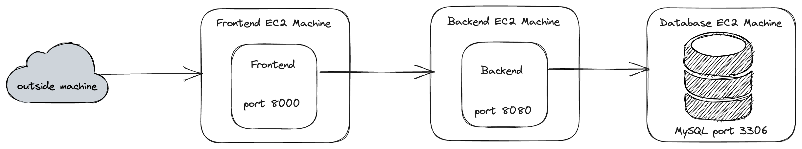

## Three Tier Web Architecture

Right now all the components of our three tier web application are running on one machine, which is the Linux instance that we have spun up. This is actually BAD practice, you can read about some reasoning [here](https://www.baeldung.com/cs/deploy-database-web-server). Some quick reasons for this include:

- Decreased flexible scalability: since every tier is running on one machine you can not scale those tiers independently
- Decreased security: usually someone having access to your database/storage is bad, they can run queries against it and even worse delete data
- Decreased reliability: your whole application is a single point of failure. If the machine that is running your three tier application is turned off, the whole application goes with it

How we alleviate these issues is to run the separate tiers of the three tier web application on different machines or groups of machines. We can then have different policies/configuration for these machines that address the weaknesses of each tier. For instance, for the storage/database tier we can make sure that only a few IP addresses or DNS addresses can access the instance that is running it, or we can give more resources: CPU, memory to the backend application tier since it will be the tier that will be dealing with the most computation. Separating out these tiers gives us that advantage to specify the needs of whatever we are dealing with.

Let us look at how to separate out the applications to different tiers practically.

### Front End Tier

Just like we have created a machine in the past for our general Linux practice we will create a machine that will only run our front end code.

You can follow the steps listed in the Linux module to create an EC2 instance. You can associate the same `*.pem` key for authentication that we used with our current instance.

At this point we can be a bit more specific when it comes to security and security grouping for instances (where to allow traffic from).

Let us create a security group for the Front end machine.

**Step 1:** Access Security Groups

Log onto the AWS Console and access the EC2 Dashboard. On the left hand side you should see a menu option titled `Network & Security`, click on the down arrow if it is collapsed, and then click on the `Security Groups` sub menu option.

**Step 2:** Create a Security Group

You can create a security group by clicking on the orange button near the top left.

The form will ask you about what you want to name the security group, you can name it `frontend-group`. You also have to give it a description, you can type anything you want here while being descriptive.

You should create inbound rules for this group that will allow traffic from anywhere IPv4 on port `22` (ssh, so we can ssh onto this machine), and port `8000`, that is the port the front end server will be running on.

**Step 3:** Attach the security group onto the instance

Go to the tab to show your EC2 instances. Check your front end instance, and click on the `Actions` dropdown on the top left of the page. Under that click on the `Security` menu option which should pop up another menu where you can click `Change security groups`. You should remove the current security groups you see and add the `frontend-group` which we have created above.

With all these steps implemented above, you should be able to `ssh` on the front end machine that we have just provisioned.

Now that you have set up the relevant security groups. Copy the front end code onto this machine. that will be everything under `app/` minus the `python` subdirectory.

So the files that should end up on your front end machine will be:

- `app/js/app.js`
- `app/index.html`

In the `app/js/app.js`, you have to make sure you replace the IP Address with that of your backend server, which we will provision next.

### Backend Tier

Create another EC2 instance for the backend application to run. Following the steps above we mentioned for security groups you should create another security group called `backend-group`, and give it inbound rules to allow traffic from anywhere IPv4 on port `22`, and anywhere IPv4 on port `8080`.

As far as the files you should copy the `python` directory under `app` into this machine.

The files that should end up on this backend machine will be:

- `python/main.py`
- `python/requirements.txt`
- `python/names.sql`

Once you have copied all of these files, install the python dependencies onto this machine as we did earlier on our test machine.

```bash
$ sudo apt install python3-pip
```

and then:

```bash
$ pip3 install -r requirements.txt
```

> Now for this application to work and connect with MySQL on another machine we have to change the `host` parameter on the MySQL connection in the `main.py` file.

> This is because our database is not running on `localhost` anymore but rather a remote host. Once you have provisioned your database machine which you will do in the next step, you will want to copy the Public IPv4 Address, and change the `host` parameter everywhere for the MySQL connection.

> So every where this line appears:
> ```python
>  connection = mysql.connector.connect(host="localhost", user="mysql", password="password",  port=3306, database="mysql")
> ```

> You want to change it to:
> ```python
>  connection = mysql.connector.connect(host={DATABASE_IPV4}, user="mysql", password="password",  port=3306, database="mysql")
> ```

Of course {DATABASE_IPV4} will be whatever your IPv4 address is after you have provisioned the database instance.

### Database tier

Create another EC2 instance for the database application to run. For this one create a security group called `database-group` and allow traffic from anywhere IPv4 on port `22` and port `3306` (where the database will be running).

You have to provision MySQL on this machine as we have done before on the test Ubuntu machine. We have done this before but there a couple tweaks that we need to make.

**Step 1:** Allow MySQL to accept traffic from anywhere

MySQL by default is allowed to accept traffic from origin `127.0.0.1` which is the loopback interface. However, since we are going to be accessing MySQL from another machine we should configure it to accept traffic from anywhere.

```bash
$ sudo vim /etc/mysql/mysql.conf.d/mysqld.cnf
```

Edit the line where it says `bind-address`. The current value should be `127.0.0.1`, we are going to change that to `0.0.0.0`. So in the end the line should look like:

```
bind-address = 0.0.0.0
```

**Step 2:** Restart MySQL server

After the changes to the `bind-address`, you need to restart the MySQL server, so it can pick up that change. To do this, type in the following command:

```bash
$ sudo /etc/init.d/mysql restart
```

This tells `systemd` of which we will learn about later to restart the MySQL server.

**Step 3:** Create a user that is bound to all hosts

Access the MySQL interface by doing:

```bash
$ sudo mysql
```

You should see the `mysql>` prompt. Now let us create the appropriate user, and grant them appropriate privileges:

```sql
mysql> CREATE USER 'mysql'@'%' IDENTIFIED BY 'password';
```

```sql
mysql> GRANT ALL PRIVILEGES ON *.* TO 'mysql'@'%';
```

```sql
mysql> FLUSH PRIVILEGES;
```

After these commands your MySQL server should be able to be accessed from outside the server it is provisioned on by the user we have created.

### Run all the things

It is very important to note the order in which things should be ran. A good rule of thumb is you should run applications from the storage layer upwards to the front end **in that order**.

**Step 1:** Run database

Since the database is already running by default in this setup we should not need to worry about that.

**Step 2:** Run Python backend

SSH into your python machine and then run (under your `python` directory so you should `cd` into it first):

```bash
$ python3 main.py &
```

> Make sure that you change the `host` in your `main.py` file to be the host of the database server. You can use the IPv4 DNS, or the Public IPv4 Address values.

**Step 3:** Run Frontend

SSH into your front end machine and then run (under your `app` directory so you should `cd` into it first):

```bash
$ python3 -m http.server &
```

Now if you access the front end machine on port `8000`, you should see the same application for adding names. There should be no difference functionally. The difference logically is the separation of the machines.

Here is what the flow looks like in the end:



## Security conscious

In the security groups we have actually allowed traffic from anywhere to be valid. In practice, you want to only allow traffic into your machine from the necessary places. For instance, the backend security group should only allow traffic from the front end machines' IP address, and the database security group should only allow traffic from the backend machines' IP Address.