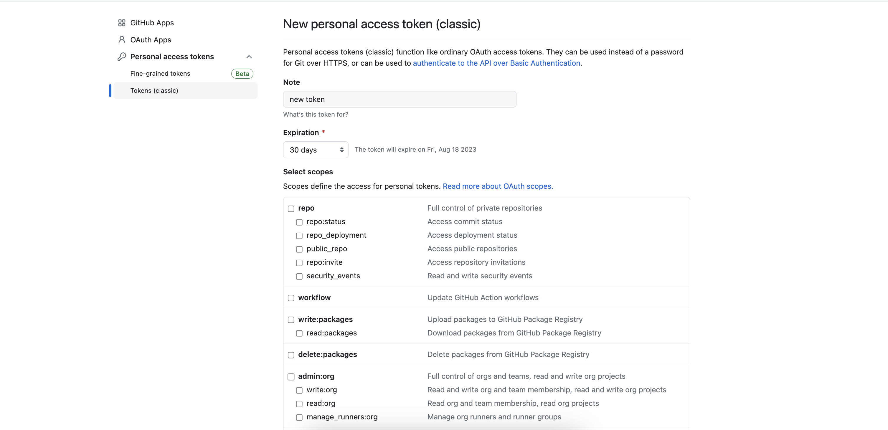

# Git

Git is a free and open source distributed version control system. What does that mean?

It essentially provides a way for developers to contribute to a certain code base in a distributed manner.

The way that this is accomplished is via what is called [trunk-based development](https://circleci.com/blog/trunk-vs-feature-based-dev/?utm_source=google&utm_medium=sem&utm_campaign=sem-google-dg--uscan-en-dsa-tROAS-auth-nb&utm_term=g_-_c__dsa_&utm_content=&gclid=Cj0KCQjwqNqkBhDlARIsAFaxvwzhNBXLKgvPTIOgUzzl0B_2thBiMyVVmQMyAC91GDqnJZBZGFGTWfoaAtEiEALw_wcB). Trunk-based development is the process of using "branches" to manage edits around the central code base. The code base is usually hosted by some provider [GitHub](https://github.com/), [GitLab](https://about.gitlab.com/), [Bitbucket](https://bitbucket.org/).


## How to get started with `Git`?

**Step 1:**

We first need to initialize what is called a git repository.

(You should first create a folder called `first-repo`, and copy all the contents of the `app/` directory into the `first-repo` folder.)

This is done via the command `git init`. It will initialize a git repository locally for a developer to start creating branches and making edits to the code.

```bash
$ git init -b main
```

Once this command completes, you will probably see the terminal prompt change to have some `git` metadata. At the end of the folder information on the terminal you might see `main`.

Within the folder if you list all files/hidden files.

```bash
$ ls -a
```

You will see a folder called `.git`.

**Step 2:**

Copy `app/` folder into the repository.

```bash
$ cp -r /path/to/app/ ./first-repo
```

**Step 3:**

Stage the changes which came from copying the `app/` folder.

Staging files means that modified files are marked ready to go into the next `commit` snapshot, which we will learn about in the next step.

You can stage the changes made on this branch by the following command:

```bash
$ git add -A
```

The `-A` flag stages all local changes made. You can specify to add specific changes by:

```bash
$ git add {path/to/file}
```

You will know which changes are staged by the green text on the filenames after running:

```bash
$ git status
```

Any files that are in red text are not staged. You might need to stage those changes individually by the `git add` command again.

**Step 4:**

Commit the changes: capture a snapshot of the staged changes.

```bash
$ git commit -m "some message describing your changes"
```

There might be some information you need to fill out in that `git` config before you commit. This allows `git` to know about the Author of the commit, basically who is making the changes that are going into the snapshot.

Once you have commit the changes, the snapshot is assigned a unique identifier called a commit hash. You can view that commit has by the command:

```bash
$ git log
```

You should see some output like the following:


```bash
commit 5c70c644722a77f8cf4e64f28e7f15a451c99ad9 (HEAD -> main, origin/main, origin/HEAD)
Author: Yoofi Quansah <yoofi@devops.com>
Date:   Tue Jul 18 00:00:00 2023 -0700

    some message describing your changes
```

The important part here is the commit hash which is the alphanumeric string to the right of "commit". You can also see the `Author` information which should be specific to your global `git` config (which you might have configured above).

**Step 5:**

Create a branch called `edit-html-code`.

```bash
$ git switch -c edit-html-code
```

A branch is basically a copy of the code base which is based off of a parent. In this case, the branch `edit-html-code` is based off of the `main` branch. Usually, it is to your advantage to give the branch a descriptive name based on the changes you want to make on the code base.

Any changes you make to this copy of the code base on the `edit-html-code` branch can be eventually merged into the `main` parent branch. You can actually see a `diff` (difference) of the two branches by running the following command:

```bash
$ git diff
```

Repeat steps 1-4 on this branch, but on step two rather than copying the `app/` folder into the local repository, make an edit to the `index.html` file. Instead of:

```html
<h1>Names</h1>
```

You can put:

```html
<h1>Names List</h1>
```

and save the changes to the file. Then you can continue with step 3-4 as normal, you should switch up the commit message this time however. Maybe to something like:

```bash
$ git commit -m "making changes to the index.html file"
```


**Step 5:**

Merge the `edit-html-code` branch into the `main` branch.

If you remember, we switched to a new branch called `edit-html-code` from the `main` branch, and made our respective changes. We have staged and committed those changes and now the change are ready to be merged into the `main` branch which will complete the development cycle.

You first need to switch to the main branch:

```bash
$ git switch main
```

Once you have switched into the `main` branch, you can merge in the `edit-python-code` branch by the command:

```bash
$ git merge edit-html-code
```

You can see if the changes were successfully merged in from the child branch by doing a `git log` on the `main` branch again.

You should see the same commit message which we put for the changes in the `edit-html-code` branch with a different commit hash then the one on the `edit-html-code` branch.

If you are a single developer working on a code base, branching does not make too much since. However, if you are a group of developers working on a single code base, working on branches is to your advantage for a lot of reasons:

- To protect the `main` branch from unwanted changes, especially during the experimental phase of a feature or bug fix
- To allow developers to work on multiple parts of the code base (folders, files) simultaneously

## GitHub

GitHub is at its heart a remote `git` repository host. It allows developers to be able to host their codebases/`git` repositories on their platform.

Once the codebase is on GitHub, developers can download a copy of the codebase and start branching locally and making edits to the codebase following the all of the instructions above.

The difference becomes where the merging actually happens. So the additional steps we will take here is pushing our branch upstream to GitHub, rather than merging the branch to `main` locally.

**Step 1:**

Create a GitHub account.

**Step 2:**

Create a new repository.

Click on your profile image, and go to the `Your repositories` section. This should bring you to a page with a list of your repositories (repos) for short. You should have 0 repos for obvious reasons, since you just created your account.

Hit the `New` button at the top right of the page, which will bring you to a page where you can specify the repository name, description, access control, etc.

Repository name: `first-repo`

Description: Learning about Git

Access control: Public

Once you have filled out these details hit the `Create repository` at the bottom right of the screen. This should take a little bit of time, but eventually create a new repository for you on GitHub.

**Step 3:**

Add the remote url of your created repository to your local `git` repository.

for the `git` repository we created above, we can add an `upstream` target for where we would want to push changes onto. In this case, we want to add the remote url of the repository we have just created on GitHub.

If you go to the page of your newly created repository, you will see a green button near the top right of the page called `Code`. Click that dropdown button, and copy the HTTPs url.

On your terminal where your local github repository lives, execute the command:

```bash
$ git remote add upstream {https_git_url}
```

Obviously, the `https_git_url` will be different for everybody based on your GitHub username, so type in whatever your url is for the command.

**Step 4:**

Push the branch `edit-python-code` to the upstream repository.

```bash
$ git push -u upstream main
```

You will be prompted to put in your `username` and `password` for authentication with the repo. Your username is the GitHub username your account is created under and your password is actually going to be a Personal Access Token or (PAT) for short.

You can attain a PAT by going to your `Settings` under your profile, and then navigating to `Developer Settings`. Under `Personal Access Tokens` click on `Tokens (classic)`. This should now give you a dropdown menu option on the top right `Generate new token`, and you should select the `Generate new token (classic)` option. You should  be taken to a page that looks like the following:



Set the token to expire in "90 days" instead of "30 days", and click the checkbox that says `repo`. This will give the token all repo priveleges it needs.

You can now copy and paste that token for the password it prompted you with, and the branch should start pushing to the hosted repo on GitHub.

You should also store the Personal Access Token somewhere on your machine, just to reference it whenever you need it, and **DO NOT SHARE THIS TOKEN WITH ANYBODY!**


**Step 5:**

Merge the changes from `edit-html-code` to `main` via GitHub.

Switch to the `edit-html-code` branch:

```bash
$ git switch edit-html-code
```

Make some more changes onto this branch on the `html` code again, instead of:

```html
<h1>Names List</h1>
```

You can put:

```html
<h1>Names List Text Box</h1>
```

Save these changes, stage them onto the branch, and commit the changes to the branch. After you have verified that the changes have been committed, you can then push that branch `edit-html-code` upstream.

```bash
$ git push -u upstream edit-html-code
```

Navigate to the repository page on GitHub, and click on the tab that says `Pull Requests`, and click the green button that says `New Pull Request`. This will bring you onto a page that will show you a `diff` (difference) of two branches. In this case, we want to merge `edit-html-code` into `main`, so we will put `main` as the base branch and `edit-html-code` as the `compare` branch.

Click on the green button `Create Pull Request`.

`Pull Requests` or PRs (for short) are a term you will hear all the time as a DevOps engineer. It is a way to start the merge process from one branch to another, in this case (`edit-html-code` to `main` branch). Engineers can see the Pull Requests and comment on them with suggestions or general feedback. The author of the Pull Request can then address those comments and feedback by making more commits onto the branch that is being compared onto `main`.

We do not have other developers in this case so we can go ahead and click the green button that says `Merge Pull Request`, it will ask you to `Confirm Merge` and show the author information, click that button. The `edit-html-branch` should now be successfully merged into the `main` branch! 🎉

The significance of this as you can imagine is that multiple engineers can push their local branches upstream to GitHub and create Pull Requests against `main` with their branch changes. The Pull Requests can then be merged 1 by 1 allowing for that multiple contributors experience for one code base.

## What's next?

As multiple developers are contributing to one code base, there becomes increased risk in introducing bugs/defects and all sorts of other issues into the code base. We are all humans and are all prone to writing incorrect software at times. We do however, want to lower the risk of introducing bugs into the software as much as possible, especially if customers are depending on sound operation of the application. With all that being said, what is the best way of trying to prevent bugs from entering the code base?

The answer is CI/CD.

CI/CD stands for Continuous Integration/Continuous Deployment. It allows for introducing some processes of validating a code base's behavior in any way the owner of the code base wants to do it. We will learn about CI/CD in depth in the next module!
