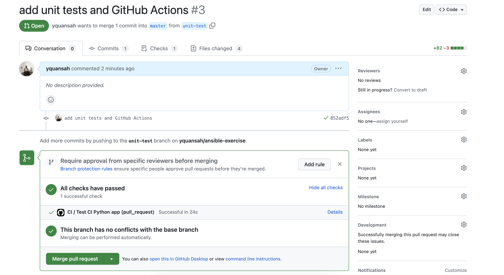

## Initializing GitHub Actions

Before you initialize any CI/CD workflow, you first want to think about the application you are setting it up for.

You want to ask yourself questions like:

- What are the important bits of functionality for this app?
- What parts of this application should be tested before we can deliver it to users?
- How can we ensure best practices of developing on this repo for future developers?

Answers to these questions will allow you to better craft an efficient CI/CD workflow for the software you are targetting.

Usually, the answer to these questions do come with extensive experience, so I will just guide you through what we will do CI/CD wise with the application under resources.

### Testing

One of the important parts of software development cycle, is the ability to test the application at hand. In most cases, this is the responsibility of the developer who is writing the Software, but could be up to the DevOps/Platform Engineers to enforce best practices around it.

Software testing is a whole topic in it of itself, and out of the scope of these modules, but to slim down to what we care about, I will give you some brief definitions.

- Unit testing: method of software testing by which individual units of a source code are tested. It is usually concerned with testing bits of the application and only the application itself
- Integration testing: method of software testing by which you test an application and all of its dependencies as a whole unit. Usually, an application will be networked, meaning it will call out to external services, and do all sorts of things. With unit testing you usually want to avoid testing the external dependencies, but with integration testing you want to include those
- Load testing: method of testing where you want to see how your application reacts under duress. The duress usually is artificially generated, but can be naturally generated as well

There are a whole load of other categories of testing, but I wanted to give you a brief overview of some the broader categories.

For our purposes, we will be writing unit tests for our Python backend. Once these tests are in order, we can run them with a CI workflow to ensure that they do pass before we continue on with other workflows or even CD.

Lets log into our development machine, and `cd` into the `ansible-exercise` directory to get started.

**Step 1:** Make sure your repository is up to date

As we have stated later on in the Git module you always want to make sure that you local repository is synced with the remote copy.

Switch to `master` branch if you are not there already.

```bash
$ git switch master
```

Run a `git pull` on your repository

```bash
$ git pull
```

Create a new branch based off of the `master` branch called `unit-testing`

```bash
$ git switch -c unit-testing
```

**Step 2:** Write out the unit tests for the Python backend

Like I said before, this is usually the responsibility of the developer, so instead of us (DevOps engineer) writing these tests, I have them for reference under the resources directory `app/python/test_main.py`. Copy the contents of that and place them in a file within the  called `test_main.py` within the `app/python` directory on your repository.

We have also modified the `main.py` file under resources to make for a better unit testing experience. So copy that over from resources directory into your machine under the `app/python` directory as well.

**Step 3:** Run the unit tests

These unit tests will test the functionality of both the routes `GET /names` which fetches all the names from the database, and `PUT /names/{name}` which stores a name into the database.

It always helps to understand the Python code, but you do not have to do that yet. I will provide some resources later about learning Python.

To run the unit tests `cd` into `app/python`, and run the following:

```bash
$ python3 -m unittest test_main.py
```

You should see a success message as output if everything worked correctly.

```
..
----------------------------------------------------------------------
Ran 2 tests in 0.010s

OK
```

To ensure that these tests are in fact being ran, you can modify the `test_main.py` file a bit. For instance, let us change the last line where it has:

```python
self.assertEqual(data["name"], "Abena")
```

to

```python
self.assertEqual(data["name"], "Aben")
```

Once you have made these changes, run the unit tests over and see the difference in output.

```
.F
======================================================================
FAIL: test_put_names (test_main.TestApp)
----------------------------------------------------------------------
Traceback (most recent call last):
  File "/usr/lib/python3.10/unittest/mock.py", line 1379, in patched
    return func(*newargs, **newkeywargs)
  File "/home/ubuntu/ansible-exercise/app/python/test_main.py", line 36, in test_put_names
    self.assertEqual(data["name"], "Aben")
AssertionError: 'Abena' != 'Aben'
- Abena
?     -
+ Aben


----------------------------------------------------------------------
Ran 2 tests in 0.011s

FAILED (failures=1)
```

As you can tell, the tests not only failed, but it provided you with what the correct assertion should be.

Now you can change that line back to what it was before.

### Run tests in CI workflow

Now that we have manually invoked these tests with Python, we want to automate the running of these tests within a CI workflow. The CI workflow can choose to do what it wants upon tests success or tests failure.

To get started with running a GitHub Actions workflow, it is pretty simple. In fact, it is as simple as creating a directory within your repository called `.github/workflows`, and within that directory, you can place some YAML files which will dictate how your workflow will run. You can see a full quick start guide [here](https://docs.github.com/en/actions/quickstart#creating-your-first-workflow)

Lets get started.

**Step 1:** Create the `.github/workflows` directory within your repository 

Self-explanatory. You can execute this command.

```bash
$ mkdir -p .github/workflows
```

**Step 2:** Create a file within `.github/workflows` called `ci.yml` and place the following contents in

```yaml
name: CI
on:
  push:
    branches:
      - master
  pull_request:
  workflow_dispatch:

defaults:
  run:
    working-directory: ./app/python

jobs:
  ci-python-test:
    name: "Test CI Python app"
    runs-on: ubuntu-latest
    steps:
      - uses: actions/checkout@v3

      - name: Install Python
        uses: actions/setup-python@v4
        with:
          python-version: "pypy3.9"

      - name: Install Python dependencies
        run: |
          python -m pip install --upgrade pip
          pip install -r requirements.txt

      - name: Run unittest on code
        run: |
          python -m unittest test_main.py
```

This is the familiar YAML structure we have seen with Ansible. If you remember YAML has the concept of arrays/lists, dictionaries, and literal values, so you can try to trace down that structure within this YAML file.

To give a quick overview of what this configuration does, it will run this CI pipeline/workflow on pull requests, pushes to the `master` branch, and on manual triggers (`workflow_dispatch`).

We reference the `working-directory` as `./app/python` which holds the code we want to test, and has the test file within it.

We have some `jobs` that describe the tasks the CI workflow will take on. The `jobs` will run on an `ubuntu` machine hosted somewhere, and execute some steps. It will first checkout/download the repository in the first step, install Python on that `ubuntu` machine in the second step, Install the Python dependencies needed to run the app and tests in the third step, and finally run the unit tests in the final step.

If you notice, this is similar to the Ansible playbooks concept. The difference here is that CI will run in an automated fashion on some triggers, of which we have stated above.

**Step 3:** Stage, commit, and push your branch

We have done this before, reference the Git module, or reach out if any questions arise.

> There might be an issue with `push`'ing, and that is because your Personal Access Token does not have the workflow scope attached to it.
> To fix this, create a Personal Access Token that has both the repo, and workflow scope.
> Once you have fixed above try pushing again, and provide that new Personal Access Token as your password.

**Step 4:** Open Pull request and see the magic

Once you open your pull request, if you have done everything correctly the Pull Request UI should look like the following:



If you notice the section where it says `All checks have passed`. there was a CI workflow that ran! That workflow has the same name we have given to the YAML file that specified the workflow + job.