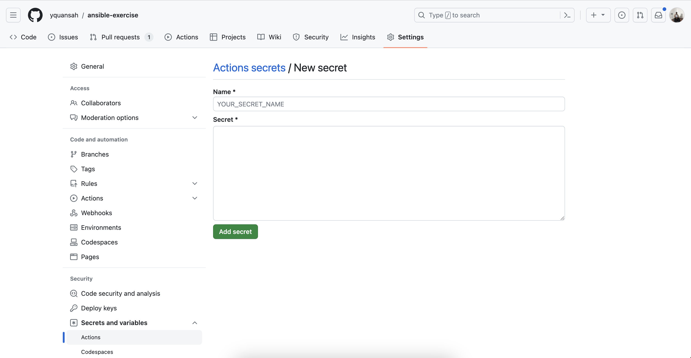
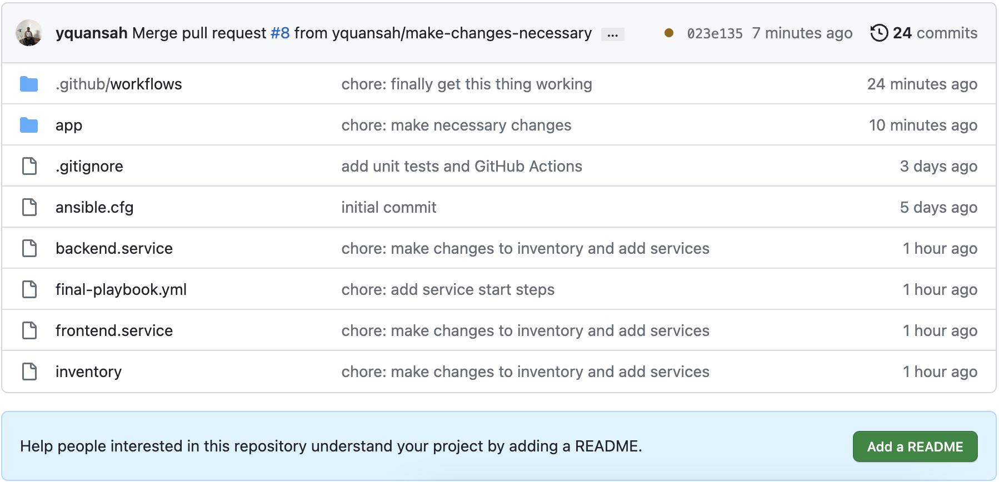

## CD

As we have said before CD (Continuous Delivery) is concerned with delivering a piece of software somewhere. Whether we deliver the software to a live running machine that has real users using it, or package up the software and deliver it to a registry/cloud hosting provider.

Regardless, there exists tooling, or you can write your own tooling to achieve that effect.

There exists a ton of dialogue out there in the communities around which tools should handle CI vs. which tools should handle CD. GitHub Actions can be more so associated with CI, but can be configured to act as a CD engine as well.

The idea here to understand is that CI/CD are not tied to a tool, but are rather general concepts, and it is up to the organization to determine which tools and processes they want to use to do either one.

If we look at the current `Adding Names` app we have been developing, this is what we want to deliver to users in the end. So if anybody makes changes to that app, it should run through our CI/CD workflow, and at the other end of the workflow will be the app that is changed, and users can now enjoy.

Let us look at how to do that!

### Adding CD job

Currently for our GitHub Actions we have a CI job that just tests our Python backend application. It should be running successfully, so now we will add some things for GitHub Actions to access our Ansible control machine, and run the playbook for each group.

**Step 1:** Change paths of private key on repository

Create a new branch based on the `master` branch, call it anything you want. (Make sure your branch is updated `git pull`).

The idea here is that we will use the GitHub Actions runner as our Ansible control machine. In order for it to access the target machines we want for the `privkey.pem` to be in a well known place.

Log into your developer instance, and change the value for `ansible_ssh_private_key_file` to `~/.ssh/privkey.pem` instead of just `privkey.pem`. Stage, commit, and push your changes to the remote once done.

Create a Pull Request against `master` branch for the changes. Once the changes pass the CI check on the remote repository, merge in the Pull Request.

**Step 2:** Add secrets to your GitHub repository

GitHub Actions has the ability to reference sensitive information which you can give it access to through secrets. We want to use these secrets to store our ssh private key, and also the ssh host name. Especially for the private key, we would not want that leaking out to the public. So let us create those secrets.

On your GitHub Repository go onto the settings tab towards the top. Under the `Security` section in the left menu, there should be a `Secrets and variables` option. Click the dropdown for that and then click on `Actions` on the submenu.

There should be a green button called `New repository secret`. Click that button and you should be directed to a page that looks like the following:



You will create one secrets for the repository.

Create `SSH_KEY`, the value for this secret will be the `privkey.pem` that we have been using all along so paste that into the `Secret` text area and hit the `Add secret` green button.

**Step 3:** Modify the GitHub Action to include the CD steps

Create a new branch based on the `master` branch, call it anything you want. (Make sure your branch is updated `git pull`).

We will rename the file `.github/workflows/ci.yml` to be `.github/workflows/cicd.yml`. With this new file we replace the existing contents with this.

```yaml
name: CI/CD
on:
  push:
    branches:
      - master
  pull_request:
  workflow_dispatch:

jobs:
  ci-python-test:
    name: "Test CI Python app"
    runs-on: ubuntu-latest
    steps:
      - uses: actions/checkout@v3

      - name: Install Python
        uses: actions/setup-python@v4
        with:
          python-version: "pypy3.9"

      - name: Install Python dependencies
        run: |
          cd ./app/python
          python -m pip install --upgrade pip
          pip install -r requirements.txt

      - name: Run unittest on code
        run: |
          cd ./app/python
          python -m unittest test_main.py

  cd-three-tier-deployment:
    name: "Deploy Three Tier Application"
    runs-on: ubuntu-latest
    if: contains('refs/heads/master', github.ref)
    needs: ci-python-test
    steps:
      - uses: actions/checkout@v3
      
      - name: Setup SSH
        shell: bash
        run: |
          eval `ssh-agent -s`
          mkdir -p /home/runner/.ssh
          touch /home/runner/.ssh/privkey.pem
          echo -e "${{secrets.SSH_KEY}}" > /home/runner/.ssh/privkey.pem
          chmod 400 /home/runner/.ssh/privkey.pem
      - name: Run Ansible playbook
        shell: bash
        run: |
          service ssh status
          sudo apt install ansible --yes
          ansible-playbook -i inventory -l database final-playbook.yml
          ansible-playbook -i inventory -l backend final-playbook.yml
          ansible-playbook -i inventory -l frontend final-playbook.yml
```

Now if you look at the top half it was the same as the previous `ci.yml`, but if you look at the bottom half starting from the key `cd-three-tier-deployment` it has a lot of steps, lets go through them.

These lines here:

```yaml
if: contains('refs/heads/master', github.ref)
needs: ci-python-test
```

tell GitHub Actions to not run this job `cd-three-tier-deployment` unless we are on the `master` branch and that `ci-python-test` has finished. So this creates the effect that we want, which is only deploy this three tier application if the tests pass, and we are on the `master` branch.

Now going over the steps. Firstly, it creates a file for the ssh key to live, which will be in the `/home/runner/.ssh/privkey.pem`. Our inventory will reference that location for using Ansible against the target machines.

Secondly, GitHub Actions installs Ansible onto the runner machine and runs the playbook for each of the three groups, starting from the database upwards.

Now that you have made these changes, let us also make some changes to the Python application, and Frontend to be able to reach the destination servers.

In the `app/python/main.py` file change the `host` parameter in the `mysql` connection to be the IP Address of the database machine.

In the `app/js/app.js` file change the `${IP_ADDRESS}` to be that of the backend machine everywhere that it is mentioned.

Once you have made all of these changes, let us do the dance again of staging, commit, and pushing the branch to the remote. Create the Pull Request, wait for the CI to pass and then merge the changes into `master`.

On the merge to master the CI/CD workflow will actually run again, but guess what? Now the CD job will run!

If you go to your repository's main page, you will see a little yellow status not next to the commit you just pushed. It should look like the following:



Once this status passes, and the yellow dot turns into a green check mark, if you access your frontend machine on port `8000`, you should still see the same three tier web application working.

**Step 4:** Make a change to the frontend

Now lets create another branch of off `master`, once it is updated again, and change the HTML located in `app/index.html` where it says:

```html
<h1>Names</h1>
```

to be

```html
<h1>Names To Add</h1>
```

Once you have made these changes, stage, commit and push the branch to the remote and merge the pull request.

Wait for the Actions to all pass, and now access the front end page, you should see the HTML of it change like so:


### What to make of this?

This was very powerful. We were able to leverage a GitHub repository to run a CI/CD pipeline to deliver live changes to a web application we are hosting ourselves.

As you can see, changes are only delivered to the live application on the `master` branch once the CI tests pass. This has the effect of only delivering "safe" changes to the application that is in use. The reason why safe is in quotes is because it is impossible to guarantee safe changes to Software. There could be bugs along the way. Our best bet as a DevOps Engineer is to enforce best practices like requiring Engineers to write more tests for the software, or setting up some other tools to cover edge cases less thought off.