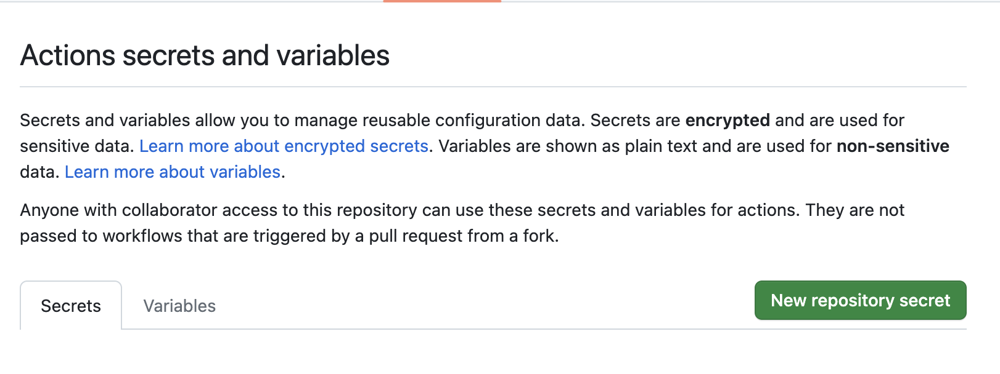

# CI/CD


CI/CD stands for Continuous Integration and Continuous Deployment. One of the most important part of the Software Development lifecycle. Basically, the two ideas are combined, they allow for a safe and streamlined delivery of software.

Continuous Integration (consists of):
- Testing the software at hand to check for any bugs
- Building a deliverable piece of software that can be ran wherever needed

Continuous Deployment (consists of):
- Taking that deliverable piece of software built by CI and running it somewhere

## How to get started with CI/CD?

### CI

This is heavily dependent on the piece of software that you want to implement the CI process on, and what exactly you deem necessary for how the software should be tested/validated.

For instance, a Continuous Integration workflow for a `python` application will look completely different then one for a Go application. This is because testing and validating code semantics in `python` will obviously be different then Go.

At the minimum for CI, workflows consists unit tests of the application (which are usually language specific), and building a deliverable piece of the software. More sophisticated CI workflows can consist of code formatters, integration tests, load tests, e2e tests, etc.

For building a deliverable, more modern CI workflows usually do that through building a `Docker` image (we will learn about later), a standalone binary for multiple platforms, etc.

### CD

CD processes are usually a little more standardized, since the deliverable piece of software has already been built. If the software already runs on a server, CD is concerned with running the updated version of the software on a server. Whether that updated piece of software replaces the one already running on a server or provisions a brand new server and runs the software on it is a deliberate and very important choice to make.

This is the concept of mutable/immutable infrastructure. You can watch a video about it [here](https://www.youtube.com/watch?v=II4PFe9BbmE). We will revisit this concept in a later module, but it is a crucial one.

## CI with `python` app

We will be using the same `app/` directory we have been using in the past two modules. We will be focusing on the `python` directory here and writing some CI processes around it.

There are many CI providers. Ones such as: Jenkins, CircleCI, GitHub Actions, etc. In our case, we will be using GitHub Actions, since we have already created a GitHub repo for our code.

This guide right [here](https://docs.github.com/en/actions/quickstart) shows how to get started with GitHub actions. Lets go with the following steps:

**Step 1:**

In your local repository, the one created in the previous module, create a `.github/workflows/`.

```bash
$ mkdir -p .github/workflows
```

**Step 2:**

In the `app/python` directory, create a file called `test_main.py`, and place the following contents in there.

```python
import unittest
from main import say_hello

class MainTests(unittest.TestCase):
    def test_say_hello(self):
        self.assertEqual(say_hello(), "Hello World")

if __name__ == "__main__":
    unittest.main()
```

And also modify the `main.py` file to have the following contents.

```python
from flask import Flask

app = Flask(__name__)

def say_hello():
    return "Hello World"

@app.route("/")
def hello():
    return say_hello()

if __name__ == "__main__":
    app.run(host="0.0.0.0", port=8080)
```

What we are doing is adding a unit test for the `main.py` function `say_hello()`, and validating that it returns the correct string. Writing unit test is a very crucial part of the software development lifecycle, because it allows for checking/validating the business logic in the application. It gives the developer a piece of mind when they can validate ahead of time that the code does what it needs to do, therefore mitigating the risk of introduced bugs in the software.

**Step 3:**

Run the unit test and validate that it is successful.

```bash
$ python -m unittest test_main.py
```

You should see the following output:

```bash
.
----------------------------------------------------------------------
Ran 1 test in 0.000s

OK
```

This means the test ran succesfully.

You can change the string assertion line and see that it fails when you rerun the test.

Failures look like the following:

```bash
F
======================================================================
FAIL: test_say_hello (test_main.MainTests)
----------------------------------------------------------------------
Traceback (most recent call last):
  File "/Users/yoofiquansah/Documents/personal/notes/devops-compilation/07-cicd/test_main.py", line 6, in test_say_hello
    self.assertEqual(say_hello(), "Hello orld")
AssertionError: 'Hello World' != 'Hello orld'
- Hello World
?       -
+ Hello orld


----------------------------------------------------------------------
Ran 1 test in 0.001s

FAILED (failures=1)
```

It will tell you the file, test, and line number of the code where the failure occurred, plus how that test failed. In this case, I changed the test to:

```python
self.assertEqual(say_hello(), "Hello orld")
```

So the test is saying that "Hello World" the return value of the `say_hello()` function does not equal "Hello orld", which we are trying to assert the value against.

**Step 4:**

As we have already created a `.github/workflows` directory in our repository, copy and paste the `ci.yml` in the `gh-action` directory in this module. It should look something like this:

```yaml
name: CI
on:
  push:
    branches:
      - main
  pull_request:

defaults:
  run:
    working-directory: ./app/python

jobs:
  ci-python-test:
    name: "Test CI Python app"
    runs-on: ubuntu-latest
    steps:
      - uses: actions/checkout@v3

      - name: Install Python
        uses: actions/setup-python@v4
        with:
          python-version: "pypy3.9"

      - name: Install Python dependencies
        run: |
          python -m pip install --upgrade pip
          pip install -r requirements.txt

      - name: Run unittest on code
        run: |
          python -m unittest test_main.py
```

This is configuration for a GitHub actions CI workflow. GitHub actions allow you to basically run a set of instructions on a remote computer. In this case, we are running the workflow on an ubuntu instance. The configuration for what things we should run are declared in this `yaml` format, the same language we have used to write our Ansible playbook in the automation module. YAML is pretty declarative in nature, and one might be able to deduce what is going on there without having every looked at `yaml` before. However, in plain English what this workflow is doing is:

1. Installing python on the machine where the GitHub action workflow is running
2. Installing the python dependencies via the `requirements.txt` (the test needs `flask` to run)
3. Run the unit test

**Step 5:**

Stage, commit, and push this branch upstream to the remote GitHub repository.

This should trigger the GitHub action to run the workflow, and do exactly as we have told it do to.


## CD with Python app

We are going to use Ansible for Continuous Delivery with the `python` application. Note here that we are using the mutable infrastructure strategy for running the `python` application, something we have briefly talked about above. Essentially, every time we run this workflow the already running `python` application on the server will be stopped, and the newly updated ython code will be ran in its place on the same server.

**Step 1:**

From this directory, copy the `playbook.yml` file into your local repository. Preferably, you can create a folder called `ansible/` and then copy the `playbook.yml` file into that folder.

**Step 2:**

Store the contents of your private key on your GitHub repository securely.

Go to your repository page, and click on the `Settings` tab at the top. In the right panel, click on the dropdown `Secrets and Variables` and from that dropdown click `Actions`. This should bring you to a page that looks like the following:



From that page, click on the `New repository secret` green button. For the name of the secret put `ANSIBLE_SERVER_PRIVATE_KEY`, and for the value of the variable place the contents of the private key in that section.

**Step 3:**

Replace the `ci.yml` in the `.github/workflows` folder with the `cicd.yml` file.

GitHub actions has its own set of action libraries that we can use as reusable configuration, sort of like the Ansible modules. What is different from `ci.yml` to `cicd.yml` is the introduction of the `Run Ansible Playbook` step. It basically runs an Ansible playbook on the machine that is running the GitHub actions workflow. It will `ssh` onto the remote host your provide configuration for and run all the necessary steps that you specify.

Make sure in this `cicd.yml` you replace the `{Public IPv4 DNS}` with your actual value for your machine on AWS.

**Step 5:**

Stage, commit, and push these branch changes upstream.

Once the GitHub Action workflow completes, you should see that the `python` application is running on your EC2 instance. You can actually make requests to it once you `ssh` onto your EC2 instance and see if it all works.

## What's next?

Although not immediately obvious, there can be a lot of pain with provisioning the servers. Everything from installing the necessary language runtimes, and the other necessary software like git, to be able to run an application on a remote server.

In our instance, we have had to install a couple things on our EC2 instance already before this module. What happens in the case where we change the language implementation to use `JavaScript` or `Golang` instead of `python`? In this case `python` is really no longer needed on our EC2 instance at least for the time being.

Also, what happens when the `python` version is different on the machine you are developing vs. the EC2 instance we are running the application on? The behavior of how the application runs on the machine it is being developed on might be different than the machine it is running on.

For these cases, should we just enumerate all of these potential cases, and codify them in an Ansible playbook?

No, we should not. We ideally want to keep the Ansible playbook, and the machines it is targeting as stateless as possible. Fortunately, there exists a technology methodology that can help out with these issues, Containerization.

We will be looking at containerization and a specific containerization technology in the next module, [Docker](https://www.docker.com/).
