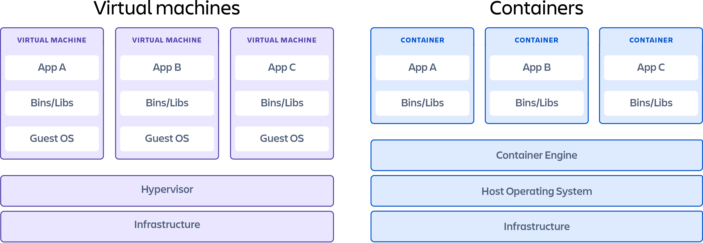
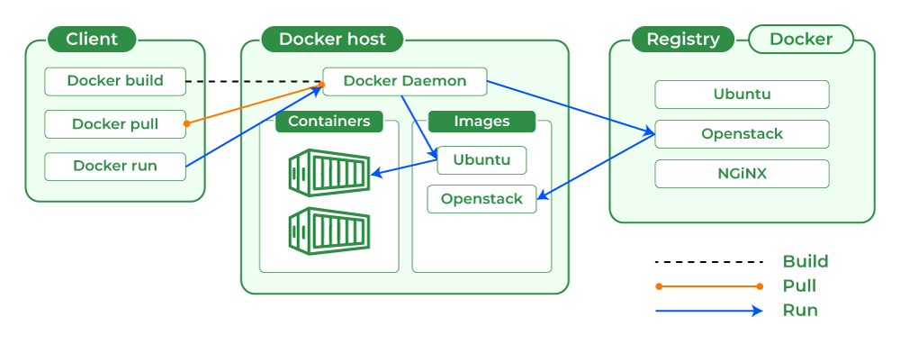

## Introduction

[Containerization](https://aws.amazon.com/what-is/containerization/#:~:text=Containerization%20is%20a%20software%20deployment,matched%20your%20machine's%20operating%20system.) is a layer of virtualization that tries to solve application level concerns. Up until now we have been using VMs (Virtual Machines) to run all of our applications. These worked fine, and provided us a level of isolation from one layer to the next (frontend, backend, database). However, the VMs also came with a lot of pre-installed software and other bells and whistles that the applications we ran on them do not necessarily care about. Also, running just one application on a VM which is capable of much more can be a waste of resources.

Containerization gives us the best of both worlds, isolation, and giving an application exactly what it would need in order for it to run in the way intended. For instance, if we wanted to run a Python application (like the web server we have), we would not need other programming language runtimes like (ruby, php, node.js, etc) on a machine. We can just provide a Python runtime, and its dependencies.

> If you look at the above image you get a sense of how the difference between VMs and containerization.
> Essentially each machine that wants to run a container will need some form of containerization technology engine installed onto it.

Each container acts just like a separate machine, but are most likely slimmed down according to whatever the user wants to run on it.

There are many different types of containerization technologies but the one we will be focusing on is the industry standard [Docker](https://www.docker.com/). Docker has many components to it, but essentially if any machine wants to run a Docker container on it, it would have to have the Docker Daemon which is the "containerization technology engine" described above.

Here is a nice architecture diagram of Docker.

As you can see, there are commands that will come from a docker client such as `docker build`, `docker pull`, and `docker run`. The Docker Daemon is in charge of listening to these commands and responding appropriately. It is also in change of managing the containers that are running.

The containers get its definitions from [docker images](https://www.techtarget.com/searchitoperations/definition/Docker-image#:~:text=A%20Docker%20image%20is%20a,virtual%20machine%20(VM)%20environments.). These images are basically a set of instructions on how a container should be built, what pieces of software should go onto it, so forth and so on. The docker image could also be archived and shared in "registries". As you can see in the diagram, the Docker daemon pulls these images from a registry hosted somewhere and runs the container based on the image on its host.

Just like how you can pull images from a registry, you can also build images yourself and host them on a registry.

We will get into more detail in the next sections.